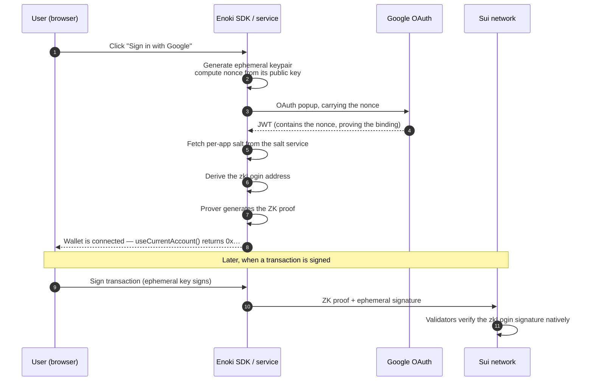

# 1. zkLogin — how a Google account becomes a Sui wallet

## 1.1 The problem it solves

A normal blockchain wallet is a **private key**: a 64-character secret, usually backed up as a
12-word seed phrase. Whoever holds it controls the account. Lose it and the account is gone
forever; leak it and the account is stolen.

For Konfirm's target user — the PRD calls her *Auntie Lim* — this is a non-starter. She is
being asked to check a WhatsApp forward. She will not install a browser extension, and she
will not write down twelve English words.

**zkLogin** is Sui's built-in answer: the user signs in with Google, and that Google account
*becomes* a Sui address. There is no seed phrase to lose, because there is no long-lived
private key on the user's side at all.

> **Formal phrasing for the pitch:** *"zkLogin is a native Sui primitive that derives a
> blockchain address from an OAuth identity, using a zero-knowledge proof so that the
> on-chain record never discloses the underlying Google account."*

## 1.2 The two properties that make it non-obvious

Anyone can build "log in with Google, and our server keeps a wallet for you." That is
custody — the user is trusting *us*. zkLogin is different in two ways:

1. **The chain itself verifies it.** Sui validators natively understand a zkLogin signature.
   No middleman signs on the user's behalf; the address genuinely belongs to the user.
2. **The Google identity stays private.** The transaction on Sui does not contain the user's
   email, their Google ID, or the login token. It contains a **zero-knowledge proof** that
   such a token exists and matches this address. Nobody browsing Suiscan can tell who signed.

That second point is the "zk" in zkLogin, and it is the sentence judges usually want to hear.

## 1.3 The moving parts, in plain terms

| Term | Plain meaning | Where it lives |
|---|---|---|
| **JWT** | The signed "yes, this really is that Google user" ticket Google issues at login | Browser, never sent to the chain |
| **Ephemeral keypair** | A throwaway keypair the browser generates for this session; it does the actual signing | Browser memory, expires after a set number of Sui epochs |
| **Nonce** | A fingerprint of the ephemeral public key, embedded *inside* the JWT by Google | Ties the throwaway key to the Google login |
| **Salt** | A per-application secret value mixed into the address derivation, so the address cannot be traced back to the Google ID | Enoki's salt service |
| **ZK proof** | The cryptographic argument that all of the above is consistent — without revealing the JWT | Generated by Enoki's prover, submitted with the transaction |
| **zkLogin address** | The resulting `0x…` Sui address | On-chain, public |

### How the address is derived (conceptually)

```
address_seed = hash( google_subject_id , google_client_id , salt )
sui_address  = hash( zklogin_flag , google_issuer , address_seed )
```

Two consequences you should be ready to state:

- **Same Google account + same app ⇒ always the same address.** This is FR-11 (identity
  stability) and it is what makes a user's records accumulate under one identity.
- **The salt is per-application.** The same Google account used in a *different* Enoki app
  produces a *different* address. This is why `docs/Enoki_setup.md` warns, in bold, never to
  delete and recreate the Enoki app — every existing user's address would change.

## 1.4 The login flow, step by step



**Where this lives in our code:**

| Step | File |
|---|---|
| Register Google as a wallet the app can connect to | `next/app/providers.tsx` → `registerEnokiWallets` |
| The actual "Sign in with Google" button | `next/app/components` → `<GoogleLogin />`, filters `useWallets()` by `isEnokiWallet` |
| Reading the signed-in address | `next/lib/signer.ts` → `useKonfirmIdentity()` |
| Signing + executing the on-chain write | `next/lib/sui/useSignAndExecuteTransaction.ts` |

## 1.5 What Enoki actually gives us

zkLogin is a Sui protocol feature; it is not a product. To use it raw, you would have to run:

- a **salt service** (store and serve each user's salt, consistently, forever),
- a **prover service** (generate the zero-knowledge proof — computationally heavy),
- OAuth plumbing and the wallet interface.

`docs/Enoki_setup.md` estimates that as **2–3 days**. **Enoki** (by Mysten Labs, who built
Sui) packages all three behind one API key, plus a fourth thing we need anyway: **sponsored
transactions** (see [03-gas-fees.md](03-gas-fees.md)).

We hold two Enoki keys, and the split matters:

| Key | Env var | Where it may appear | What it can do |
|---|---|---|---|
| Public | `NEXT_PUBLIC_ENOKI_API_KEY` | Browser — safe to expose | zkLogin only |
| Private | `ENOKI_SECRET_KEY` | **Server only**, never `NEXT_PUBLIC_` | zkLogin **+ sponsorship** |

Sponsorship requires the private key, and a private key can never ship to a browser.
**That single fact is why Konfirm has a backend at all** — see `next/lib/enoki/sponsor.ts`,
whose header comment documents the correction after the team's first assumption proved wrong.

## 1.6 Two behaviours that will be noticed on stage

**1. Enoki does not show a wallet confirmation popup.** With MetaMask or Sui Wallet, the user
sees "Approve / Reject" before anything is signed. With Enoki, one click signs and submits.
So we built our **own** confirm-before-sign screen — signing in is not consent to publish.
A signed-in user still lands on `/confirm`; they only skip the sign-in gate
(`next/app/(check)/flow.tsx`). If a judge asks *"does the user know they are writing to a
blockchain?"* — that screen is the answer.

**2. The user's address holds 0 SUI, forever.** That is not a bug; it is the proof that
sponsorship works. See the evidence table in [03-gas-fees.md](03-gas-fees.md).

## 1.7 Honest limits (state these before you are asked)

- **The ephemeral key expires.** zkLogin sessions are bounded by a maximum Sui epoch; after
  that the user signs in with Google again. It is a re-login, not a lost account.
- **The address depends on our Enoki app.** If the app were deleted and recreated, every
  user's address would change. Operationally this is a "do not touch" item, documented in
  `docs/Enoki_setup.md` §6.4.
- **`/api/attest` does not yet verify the zkLogin JWT server-side.** The TRD calls for it;
  the route's own comment records it as an open gap (`next/app/api/attest/route.ts`). Today
  the gate is "you went through the app's flow." Say so plainly if asked about abuse.
