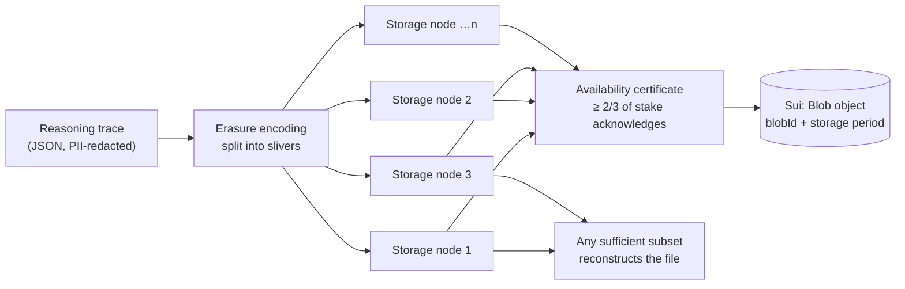

# 2. Walrus — decentralised storage, and why we need it

## 2.1 Why the blockchain alone is not enough

Blockchain storage is extremely expensive, because **every validator stores every byte,
forever**. Sui is designed for small structured records: numbers, addresses, short strings.

Konfirm's reasoning trace is the opposite of small. It is the full output of several AI
models — descriptions, key signals, per-model reasoning paragraphs, in three languages.
Putting that on-chain would be costly and, frankly, an abuse of the chain.

But we cannot just put it in our own database either, because that destroys the entire
product argument. If the reasoning lives on a Konfirm server, we can quietly edit it, and the
sceptical relative is back to trusting us.

**Walrus is the resolution.** It is a decentralised blob-storage network built by Mysten Labs
(the Sui team) that stores large files across many independent storage nodes, with its
bookkeeping — who stored what, until when — recorded on **Sui**.

> **Formal phrasing:** *"The verdict summary is anchored on Sui; the full reasoning trace is
> stored on Walrus, a decentralised storage protocol whose availability guarantees are
> themselves enforced on Sui. Sui holds only the content-addressed blob identifier."*

## 2.2 How Walrus works internally

The mechanism worth knowing is **erasure coding**, specifically Walrus's *Red Stuff* 2D
encoding.

Naive decentralised storage replicates the whole file to every node. With 100 nodes that is
100× the storage cost. Walrus instead **splits and encodes** the file into fragments called
**slivers**, distributed one to each storage node, such that **any sufficiently large subset
of slivers can reconstruct the original file**. No single node holds the whole file, and a
large fraction of nodes can go offline without the data being lost.

The result: strong availability at a replication overhead of roughly **4–5×** rather than
100×. That is the number that makes storing full AI reasoning traces economically sane.



Three concepts to be able to name:

| Concept | Meaning |
|---|---|
| **Blob** | One stored file. Ours is a JSON document. |
| **Blob ID** | A content-derived identifier — a cryptographic commitment to the encoded content. **The same bytes always produce the same blob ID.** |
| **Availability certificate** | Proof that enough storage nodes (by stake) have acknowledged holding the slivers. Once certified, the blob is registered on Sui. |

**Why "content-derived" matters for our pitch:** the blob ID is derived from the content, so
the content cannot be swapped without changing the ID. The ID sits in an immutable field of
an on-chain object. Therefore **the reasoning trace cannot be quietly rewritten** — a changed
trace yields a different blob ID, which no longer matches what the chain recorded. This is
the *"cannot be quietly swapped"* claim in the README, stated precisely.

A useful side effect appears in our own code: if the identical trace is uploaded twice,
Walrus responds `alreadyCertified` instead of `newlyCreated`, and we read the blob ID out of
whichever field is present (`next/lib/attest/walrus.ts`).

## 2.3 Publisher and aggregator — the two doors

Talking to storage nodes directly requires a Walrus client and tokens. For web applications,
Walrus exposes two HTTP gateways:

| Gateway | Direction | What it does for you | Our env var |
|---|---|---|---|
| **Publisher** | Write | Accepts raw bytes, performs the encoding, pays for storage, registers and certifies the blob on Sui, returns the blob ID | `WALRUS_PUBLISHER` (**server only**) |
| **Aggregator** | Read | Fetches slivers from storage nodes, reconstructs the blob, serves it over plain HTTP | `NEXT_PUBLIC_WALRUS_AGGREGATOR` (public) |

Our write path is deliberately minimal — `next/lib/attest/walrus.ts`:

```ts
PUT {publisher}/v1/blobs        // body: the JSON trace
→ { newlyCreated: { blobObject: { blobId } } }   // or { alreadyCertified: { blobId } }
```

Our read path — `fetchTrace()` in `next/lib/sui/verdict.ts`:

```ts
GET {aggregator}/v1/blobs/{blobId}
```

The read is cached for an hour (`next: { revalidate: 3600 }`) precisely because the blob is
immutable: there is no such thing as a stale read of an immutable object.

**Note the asymmetry, it is a security point:** the publisher URL is server-only because
writing costs money; the aggregator URL is public because reading is free and open to anyone.

## 2.4 Storage is rented, not bought

This surprises people, so know it: **Walrus storage is paid per epoch, and it expires.**
When a blob is stored, a storage duration is purchased. When it lapses, the data is no longer
guaranteed to be retrievable. Storage can be extended by paying for more epochs.

We are affected by this today, and it is already written up honestly in `docs/wallet.md`:
our publisher call sends no epoch parameter, so it takes the publisher's default (short, on
public testnet). **One of our four live verdicts already returns 404 on its `trace_blob`** —
the on-chain record survives, the reasoning is gone.

Two things follow, and both are good pitch material rather than embarrassments:

1. **The application degrades correctly.** `fetchTrace()` returns `null` on any failure, and
   `/v/[objectId]` renders the on-chain evidence — score, model count, request IDs, dispute
   count, timestamp — with the prose omitted and `hasTrace: false`. A verdict without its
   trace is still a valid public record. This is anticipated in the TRD as risk **R-2**.
2. **The fix is a parameter, not a redesign.** Request more epochs on upload
   (`PUT /v1/blobs?epochs=N`), and for a production deployment run our own publisher, or use
   the Walrus SDK server-side with a funded keypair, so the storage period is our decision
   rather than a public gateway's default.

> If the demo needs its traces intact on the day, re-upload the blobs with a longer storage
> period beforehand. That action item is already in `docs/wallet.md`.

## 2.5 Walrus is public by default

There is **no access control** on a Walrus blob. Anyone holding the blob ID can read it, and
the blob ID is written into a public on-chain object. This is intentional for us — a
verification record that only we could read would be pointless.

It is also why **PII redaction happens before upload, not after** (`next/lib/attest/redact.ts`,
TRD requirement TR-10). A model's reasoning can quote the original WhatsApp forward verbatim,
and those forwards routinely contain phone numbers, IC numbers and email addresses. Malaysian
PDPA 2010 applies, and permanent public storage is unforgiving of mistakes:

| Pattern | Replaced with |
|---|---|
| `+?60\d{8,9}` (Malaysian mobile) | `[redacted-phone]` |
| `\d{6}-\d{2}-\d{4}` (IC number) | `[redacted-ic]` |
| email addresses | `[redacted-email]` |

`redactDeep()` walks the whole JSON structure and redacts **every string leaf**, so no field
of any verdict shape can be forgotten. If confidential storage were ever required, Walrus's
companion product **Seal** provides encryption — we do not use it, because our data is
intended to be public.

## 2.6 Why Walrus rather than IPFS or S3

This is in the TRD's technology-choice table (§Storage), and it is a fair judge question:

| Option | Why not |
|---|---|
| **Amazon S3 / our own database** | Centralised. We could edit or delete the trace, which destroys the trust argument. |
| **IPFS** | Content addressing is comparable, but persistence requires paying a pinning service — another centralised dependency — and it sits outside the Sui ecosystem. |
| **Walrus** ✅ | Content-addressed, decentralised, **and** its availability bookkeeping is enforced on the same chain that holds our `Verdict` object. One trust domain, not two. |
