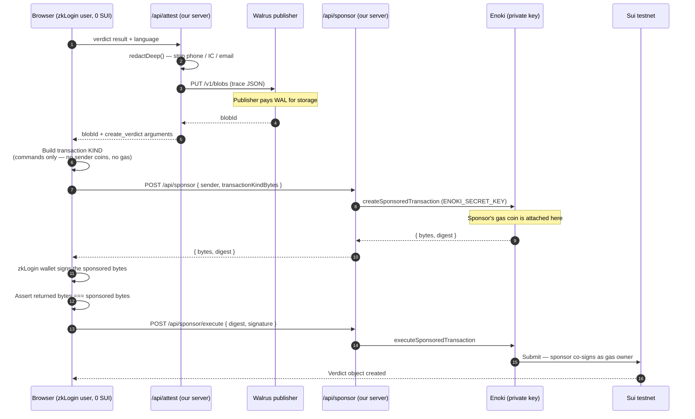
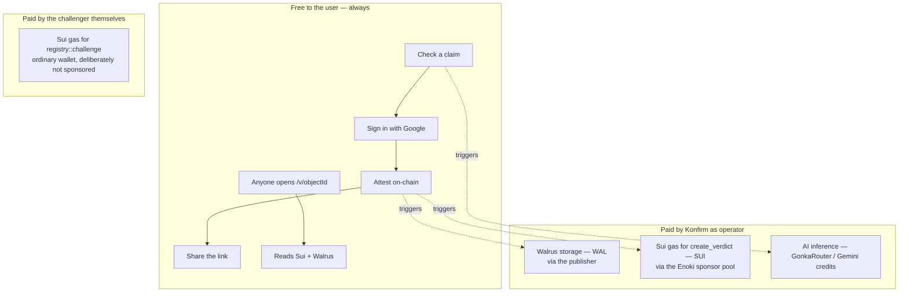

# 3. Gas fees — who pays for what, at which step

> This file answers the leader's question directly: *"zkLogin connects to a wallet, which
> writes to Walrus and Sui — so how does the gas fee work?"*

## 3.1 First, separate three things people merge into one

The question contains three distinct payments that happen at three different moments, in two
different currencies, paid by three different parties. Getting this table right is most of
the answer.

| # | What is paid for | Currency | Who pays | Does the user ever see it? |
|---|---|---|---|---|
| 1 | **Walrus storage** for the reasoning trace | WAL (+ a little SUI for the register/certify transactions) | The **Walrus publisher** we call, from our server | No |
| 2 | **Sui gas** for `create_verdict` | SUI | The **Enoki sponsor pool** (our account) | No — the user holds 0 SUI |
| 3 | **Sui gas** for `challenge` | SUI | The **challenger's own wallet**, deliberately | Yes — and that is the design |

And one more, worth saying because it pre-empts a follow-up:

| 4 | **Reading** — the verification page, the Walrus blob | nothing | nobody | Reads are free on both Sui and Walrus |

## 3.2 The correction that cost this team a day

`docs/Enoki_setup.md` originally stated — and the internet still widely repeats — that once a
Move function is allowlisted in the Enoki Portal, gas is paid automatically and no backend
code is needed.

**That is false**, and `next/lib/enoki/sponsor.ts` documents why in its header comment:

> `registerEnokiWallets` produces a wallet exposing only `sui:signTransaction` and
> `sui:signAndExecuteTransaction`. Both internally call `transaction.build({ client })`,
> which looks for a gas coin **belonging to the user's own address**. A zkLogin account has
> a balance of zero, so this fails with "no gas coin found."

Sponsorship in the SDK lives behind `EnokiClient.createSponsoredTransaction`, and Enoki's own
documentation states that *sponsoring transactions requires a private API key*. A private key
must never reach a browser. **Therefore sponsorship requires a server.** That is the entire
reason `app/api/sponsor` exists.

This is a strong answer if a judge asks what was hard: *"we found that the documented
behaviour did not match the SDK, and rebuilt the signing path around it."*

## 3.3 The sponsored transaction, in three legs



Everything above is wrapped in one hook, so calling code stays a single line
(`next/lib/sui/useSignAndExecuteTransaction.ts`):

```ts
const { digest, createdObjects } = await signAndExecute({ transaction: tx });
```

> Import that hook, **not** dapp-kit's identically named one. dapp-kit's version uses the
> retired JSON-RPC path *and* does not sponsor.

### Why a "transaction kind" and not a transaction

A Sui transaction has two parts: **what to do** (the commands) and **how gas is paid** (which
coin, whose address, what budget). A *transaction kind* is the first part alone. The browser
can build it with no coins and no balance; the sponsor then fills in the gas half. This is
what makes sponsorship possible without the user ever holding SUI.

### Two safety measures worth naming

- **`allowedAddresses: [sender]`** — the sponsored bytes are pinned to exactly one sender, so
  a leaked sponsor response cannot be replayed for someone else's transaction.
- **A byte-equality check after signing** — the wallet rebuilds from JSON it is handed, so in
  principle it could return different bytes than the sponsor approved. We compare and refuse
  rather than let Enoki reject it with an opaque mismatch error.

## 3.4 The allowlist — what the sponsor will and will not pay for

`allowedMoveCallTargets()` in `next/lib/enoki/sponsor.ts` returns exactly one entry:

```
${NEXT_PUBLIC_PACKAGE_ID}::registry::create_verdict
```

Deliberately absent: **`registry::challenge`**. PRD FR-13 states that challenges go through
an ordinary wallet — no zkLogin, no sponsorship. Allowlisting it would mean paying for
transactions the product says the challenger pays for themselves.

The list is derived in code from `NEXT_PUBLIC_PACKAGE_ID` and passed **per request**, so it
cannot drift away from the deployed package. Enoki matches these targets as **exact strings**,
which produces the single most likely demo-day failure:

> **Republishing the Move package changes `PACKAGE_ID`, and sponsorship then fails silently.**
> `GET /api/health` prints the exact string to allowlist, so this is checkable in five
> seconds. The full checklist is in `docs/Enoki_setup.md`.

## 3.5 The evidence that sponsorship genuinely works

Read off Sui testnet, not inferred — from `docs/wallet.md`:

| Verdict object | Sender (zkLogin user) | Sender's SUI balance | Gas actually paid by |
|---|---|---|---|
| `0xd2778e87…` | `0xedbdf75b…` | **0** | `0x0dec4c7d…` |
| `0x526415ca…` | `0xe0b2050b…` | **0** | `0x0dec4c7d…` |
| `0x00c40416…` | `0x33a9868f…` | **0** | `0x0dec4c7d…` |

Three different users, every one holding zero SUI, every transaction paid by an address that
is not theirs — Enoki's sponsor pool. **The two facts that must hold together are: the user's
balance is 0, and the gas payer is not the user.** Either alone proves nothing; both together
prove sponsorship.

If a judge asks you to prove it live: open any of those transactions on Suiscan and point at
the gas payer field.

## 3.6 Who pays for Walrus, exactly

This is the part most easily got wrong, so be precise.

Walrus storage is paid in **WAL** tokens, plus a small amount of SUI for the on-chain
register/certify transactions. The party paying is **whoever operates the publisher**.

Our code (`next/lib/attest/walrus.ts`) does a plain `PUT` to a public testnet publisher from
**our server**, inside `/api/attest`. So:

- The **user** pays nothing and needs no tokens — the upload happens server-side, before the
  user has signed anything.
- **We** pay nothing today either, because we use a **public testnet publisher** that absorbs
  the cost. That is a testnet convenience, and you should say so rather than imply it scales.
- For production, the honest answer is: **we run our own publisher, or call Walrus
  server-side with our own funded keypair.** The cost then lands on Konfirm, alongside the
  Enoki gas pool — both are operator costs, and neither ever reaches the user.

> **One-sentence pitch answer:** *"Storage is paid by the operator in WAL, gas is paid by our
> Enoki sponsor pool in SUI, and both happen server-side — the user never holds, sees, or
> spends a token."*

## 3.7 Why the challenge path is NOT sponsored

This looks like an omission and is actually a design decision, so say it confidently.

A `Challenge` is a public objection to a verdict. Persona P3 is an NGO or community
administrator who already owns a wallet. They pay their own gas because:

1. **It costs something to object.** A free, sponsored objection endpoint would be trivially
   spammable, and `challenge_count` is displayed on the verification page.
2. **It makes the objection theirs.** The challenge is signed and paid for by their own
   address, so the record shows an independent party dissented — not Konfirm paying to
   dissent against itself.

The contract requires no capability to call `challenge`: any wallet address may object. There
is no voting, no reputation weighting, no majority rule — purely an append-only dissent
record (PRD FR-13).

> Current status, be honest: `registry::challenge` exists and is tested in the Move package,
> but the P3 submission UI is not built yet. It is listed as an open item in `docs/wallet.md`.

## 3.8 The cost model on one slide


