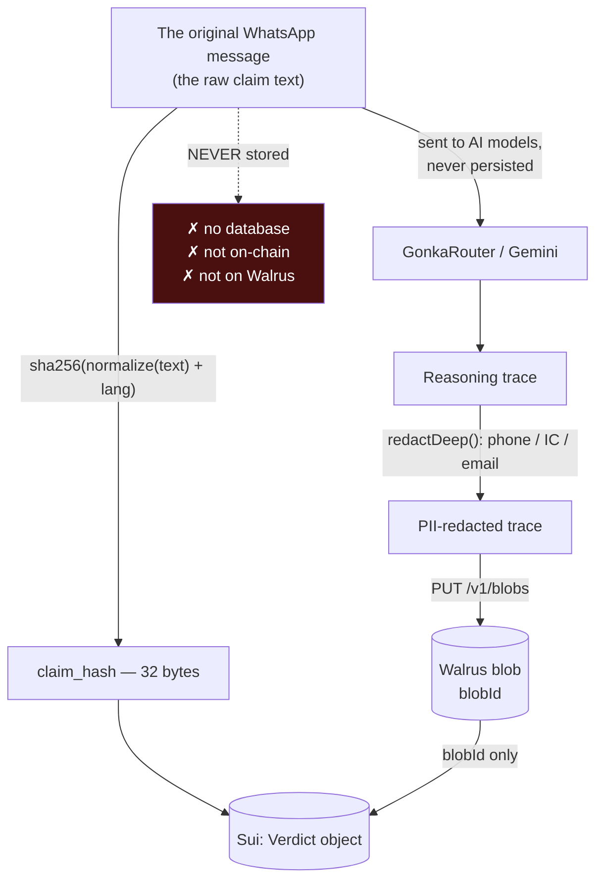
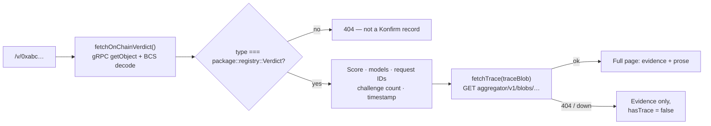
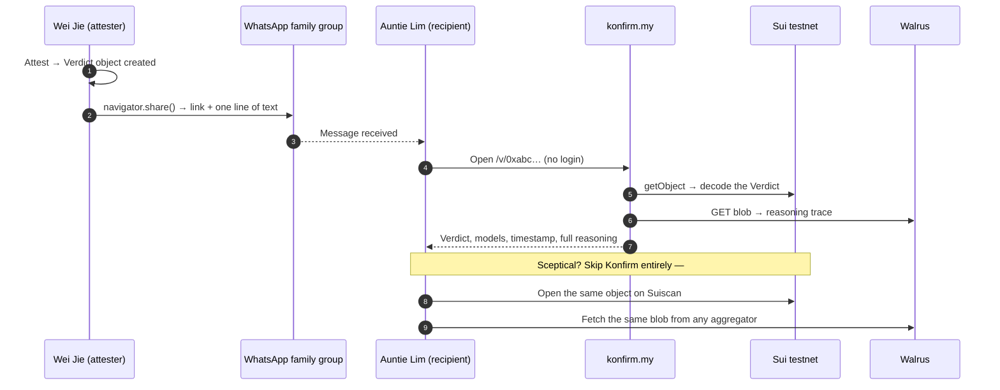

# 4. What data goes where — and what happens when a user shares

## 4.1 The three-way split

Every piece of data in Konfirm lands in exactly one of three places, and the rule behind the
split is worth memorising: **evidence on-chain, prose on Walrus, raw text nowhere.**



### On Sui — the `Verdict` object (`move/sources/registry.move`)

| Field | What it is |
|---|---|
| `claim_hash` | `sha256(normalize(text) ‖ lang)` — 32 bytes. **Never the raw text** (NFR-4, PDPA) |
| `lang` | `0 = en, 1 = ms, 2 = zh` |
| `state` | `0` verdict · `1` disputed · `2` unverifiable · `3` insufficient |
| `score` | `0–100`, or `255` (`NO_SCORE`) when the state carries no score |
| `spread_lo` / `spread_hi` | The lowest and highest individual model scores — how much they disagreed |
| `confidence` | `0` high · `1` medium · `2` n/a |
| `model_count`, `models` | How many models answered, and which |
| `request_ids` | **Gonka Request IDs** — the proof that inference actually ran on Gonka |
| `trace_blob` | The **Walrus blob ID** of the full reasoning |
| `challenge_count` | The **only** mutable field, and it can only increase |
| `created_at_ms`, `attester` | Timestamp from the on-chain `Clock`, and the zkLogin address that signed |

There is **no update function and no delete function**. That single sentence is the entire
definition of "append-only" here, and it is checkable by anyone reading the published module.

### On Walrus — the reasoning trace

The whole `/api/verdict` result, PII-redacted, plus an `attestedAt` timestamp: descriptions,
key signals, per-model verdicts and reasoning paragraphs. Roughly:

```json
{
  "state": "false",
  "score": 12,
  "models": [
    { "name": "…", "requestId": "…", "score": 10, "reasoning": "…" }
  ],
  "attestedAt": "2026-09-04T…Z"
}
```

### Nowhere — the raw claim text

There is no relational database in this system at all (TRD §1: *"the chain is the only source
of truth"*). The user's text is sent to the models, hashed in the browser, and discarded.

**Why the hash and not the text?** Because on-chain records are permanent and undeletable. A
forwarded message routinely contains a name, a phone number, or an IC number, and Malaysian
PDPA 2010 applies. If we wrote raw text on-chain and it contained PII, there would be no
remedy — none. The hash removes that risk entirely.

Note where the hash is computed: **in the browser**, using Web Crypto
(`next/lib/attest/claimHash.ts`), so the raw text never even makes a second trip to our
server for hashing. `/api/attest` never sees the claim text.

**What the hash still lets you do:** anyone holding the original message can recompute
`sha256(normalize(text) ‖ lang)` and confirm it matches the on-chain `claim_hash` — proving
*this exact message produced this exact record*. What it does **not** let you do is browse
the chain and read people's messages. That asymmetry is the design.

## 4.2 Reading a verdict back



Two details judges tend to probe:

- **The type is checked before decoding.** Any object ID at all can be pasted into that route,
  and BCS is positional — it would happily misparse an unrelated struct's bytes into
  plausible-looking garbage. `fetchOnChainVerdict()` verifies
  `object.type === ${packageId}::registry::Verdict` first (`next/lib/sui/verdict.ts`).
- **The evidence/prose split is deliberate.** Everything the page treats as *evidence* comes
  from the chain. The prose comes from Walrus. If Walrus is unreachable, the record still
  renders — degraded, not broken.

## 4.3 Sharing — the actual answer to "how does the user share this to others?"

### The short version

**The Sui object ID *is* the permalink.** No short-link service, no database of shares, no
accounts. When a `Verdict` object is created, its object ID is returned to the browser
(`createdObjects`, filtered by `::registry::Verdict`), and the app routes to a result page
holding two shareable URLs:

| URL | Purpose |
|---|---|
| `/v/{objectId}` | The **verification page** — full record, no login wall |
| `/card/{objectId}` | The **rebuttal card** — designed to be screenshotted into a group chat politely |

### The mechanism

`app/card/[objectId]/ShareButtons.tsx` uses the Web Share API:

- On a phone, `navigator.share()` opens the native share sheet — WhatsApp, Telegram,
  Messenger — and hands over the text plus the link.
- On a desktop browser without it, it falls back to copying the link to the clipboard.
- If the clipboard is blocked too, it opens the URL so the user can copy it from the address
  bar manually.

### What the recipient needs

**Nothing.** No wallet, no Google sign-in, no app install, no crypto knowledge. `/v/[objectId]`
is a server-rendered public page. That is a requirement, not an accident: PRD FR-10 says any
person must be able to independently re-check a verdict *without trusting the Konfirm website*.



### The trust argument, stated for a judge

The reason this beats "a chatbot said it's fake" is that **every layer is independently
checkable without us**:

1. The `Verdict` object can be read on **Suiscan**, or from any Sui fullnode — our website is
   not in that path.
2. The reasoning trace can be fetched from **any** Walrus aggregator using the blob ID from
   the chain — again not from us.
3. The **Gonka Request IDs** are written into both, so a sceptic can retrace which model calls
   actually produced this verdict.
4. If they still disagree, they can attach a permanent `Challenge` — which we cannot delete,
   and which increments a counter displayed on the page.

At no point does the argument require the sentence *"trust Konfirm."*

## 4.4 Known gaps — say these before someone finds them

| Gap | Status |
|---|---|
| `/card/[objectId]` still returns placeholder data (`getCard()` is a stub) | Known; `/v/[objectId]` reads the real chain |
| `/api/attest` does not yet verify the zkLogin JWT server-side | Documented in the route's own comment; TRD calls for it |
| `create_verdict` has no on-chain capability gate — a crafted client could submit a fabricated score | Documented in `registry.move`'s doc comment as a pre-mainnet design question, deliberately not decided silently |
| Walrus testnet blobs expire; one live verdict's trace already 404s | Anticipated as TRD risk R-2; the page degrades correctly. Fix: upload with more epochs |
| The P3 challenge submission UI is not built | `registry::challenge` exists and is tested; the front end is not |
