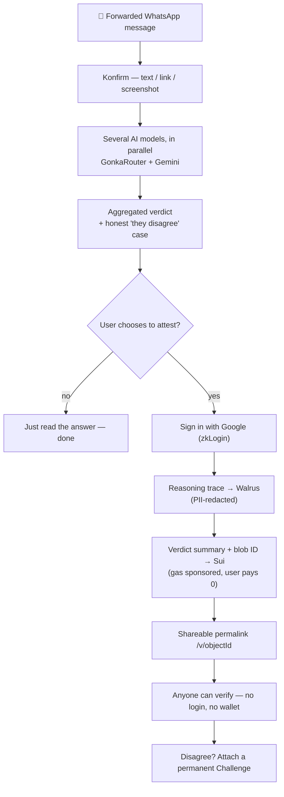
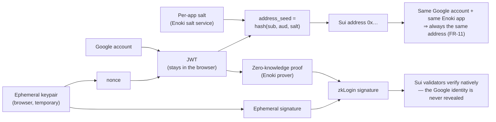
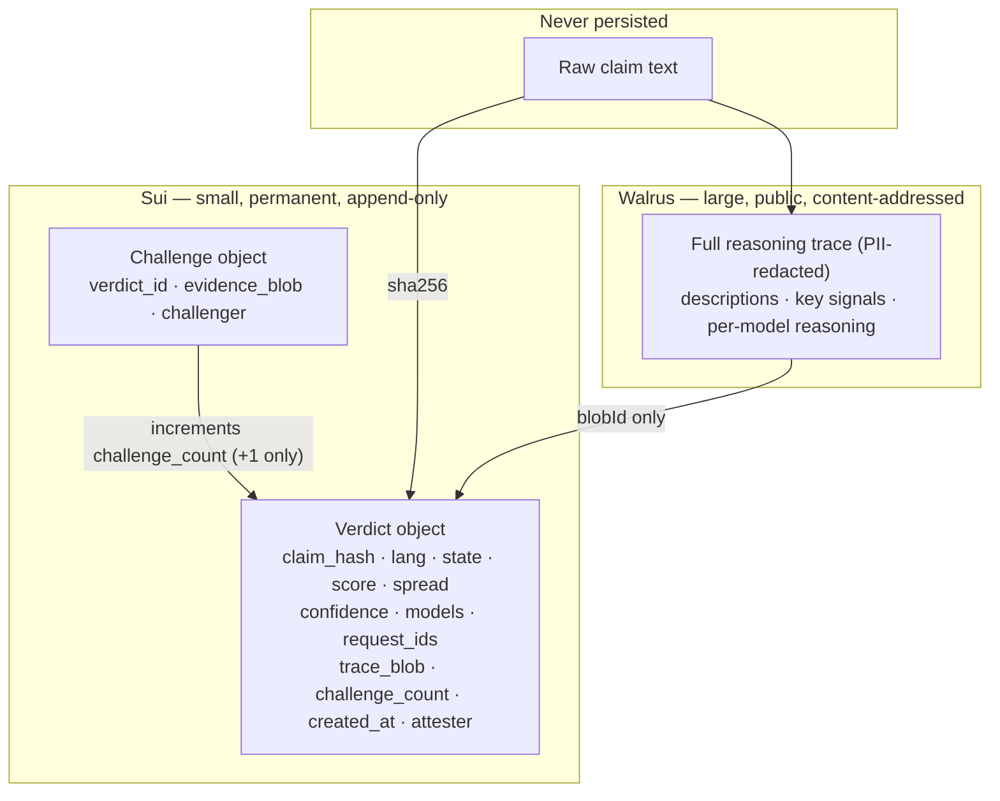
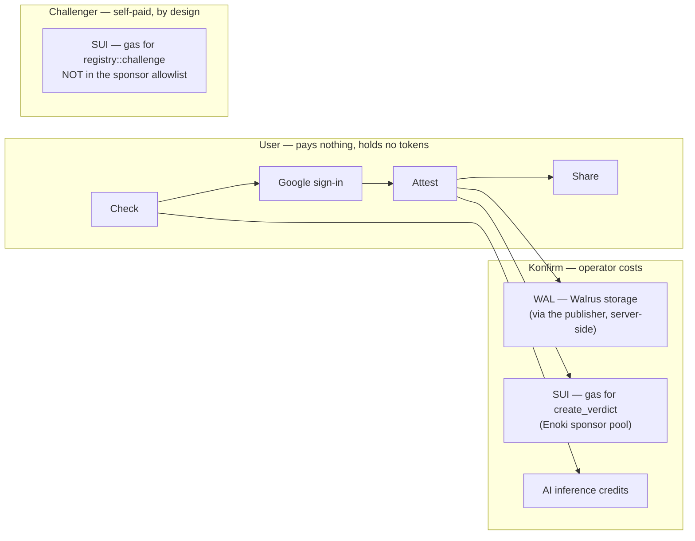
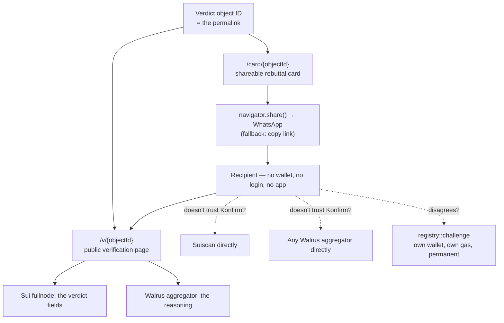

# 5. Diagrams — for slides and whiteboards

All rendered with Mermaid (GitHub, VS Code with a Mermaid extension, and mermaid.live all
display these). Copy any block into a slide tool, or screenshot from mermaid.live.

## 5.1 The one-slide overview



## 5.2 zkLogin — Google account to Sui address



## 5.3 The full attest flow, end to end

```mermaid
sequenceDiagram
    autonumber
    participant U as User
    participant B as Browser
    participant AT as /api/attest
    participant W as Walrus publisher
    participant SP as /api/sponsor
    participant EN as Enoki (private key)
    participant S as Sui testnet

    U->>B: "Save this as proof"
    B->>B: Confirm-before-sign screen<br/>(Enoki shows no wallet popup)
    U->>B: Confirm
    B->>B: computeClaimHash() — SHA-256, in-browser
    B->>AT: { lang, verdict result }
    AT->>AT: redactDeep() — phone / IC / email
    AT->>W: PUT /v1/blobs
    W-->>AT: blobId
    AT-->>B: blobId + create_verdict arguments
    B->>B: Build transaction KIND (no gas)
    B->>SP: POST /api/sponsor
    SP->>EN: createSponsoredTransaction
    EN-->>SP: { bytes, digest }
    SP-->>B: { bytes, digest }
    B->>B: zkLogin wallet signs; assert bytes unchanged
    B->>SP: POST /api/sponsor/execute
    SP->>EN: executeSponsoredTransaction
    EN->>S: Submit — sponsor pays gas
    S-->>B: Verdict object created
    B->>U: /v/{objectId} — share it
```

## 5.4 Where every piece of data lives



## 5.5 Who pays for what



## 5.6 Sharing and independent verification


