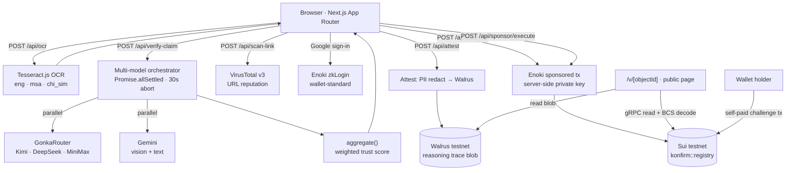

<div align="center">

# Konfirm

**Multilingual misinformation checking for Malaysia — with a receipt nobody can edit.**

Paste a forwarded WhatsApp message. Get a cross-model AI verdict in English, Bahasa Melayu
or 中文. Then put that verdict on-chain, so the person you send it to doesn't have to trust
us either.

`Next.js 16` · `React 19` · `Sui Move` · `Walrus` · `zkLogin via Enoki` · `GonkaRouter`

Sui testnet package
[`0x9c2a668463843b5838f8ad6490fb8c87299094563ba52daa53ed7754342a7344`](https://suiscan.xyz/testnet/object/0x9c2a668463843b5838f8ad6490fb8c87299094563ba52daa53ed7754342a7344)

</div>

---

## Table of contents

- [Authors](#authors)
- [Introduction](#introduction)
- [What it does](#what-it-does)
- [How it works](#how-it-works)
- [Repository layout](#repository-layout)
- [Requirements](#requirements)
- [Installation](#installation)
- [Setup](#setup)
  - [1. Environment variables](#1-environment-variables)
  - [2. Google OAuth client](#2-google-oauth-client)
  - [3. Enoki app + keys](#3-enoki-app--keys)
  - [4. Walrus endpoints](#4-walrus-endpoints)
  - [5. AI + scanning keys](#5-ai--scanning-keys)
  - [6. The Move package](#6-the-move-package)
- [Running it](#running-it)
- [Docker](#docker)
- [Route map](#route-map)
- [API reference](#api-reference)
- [Example output](#example-output)
- [Testing & quality gates](#testing--quality-gates)
- [Redeploying the Move package](#redeploying-the-move-package)
- [Project status & known gaps](#project-status--known-gaps)
- [Security, privacy & compliance](#security-privacy--compliance)
- [Resources](#resources)
- [License](#license)

---

## Authors

<!-- TODO: fill in -->

| Name | Role | Contact / GitHub |
|---|---|---|
| _TBD_ | Product / backend / Move & on-chain | _TBD_ |
| _TBD_ | Frontend / design | _TBD_ |
| _TBD_ | Pitch / content / test corpus | _TBD_ |

Built for **MUBA Hack 2026** (submission 2026-09-05, pitch 2026-09-06 @ APU), targeting the
**Gonka Router — AI For Society** and **Sui Foundation — AI × SUI** tracks.

---

## Introduction

In Malaysia, rumours and scams travel through WhatsApp family groups and Facebook shares.
The text arrives mixed — English, Malay, Chinese, dialect romanisation — with no source and
no date. Two things then happen:

- **The older relative believes it** and forwards it on.
- **The younger relative knows it's fake** but has nothing convincing to reply with, so says
  nothing.

Existing tools don't fit this. Sebenarnya.my is slow and only covers BM/EN. International
fact-checkers don't know the local context. And a single chatbot saying *"this is false"* is
just one more unverifiable assertion — why would an aunt trust a chatbot over a schoolmate of
thirty years?

**So the problem has two layers:**

| Layer | Question | Konfirm's answer |
|---|---|---|
| **Judgement** | Is this claim true, in the language it arrived in? | Several AI models are asked in parallel via GonkaRouter and their answers are aggregated — including the case where they disagree |
| **Trust** | Can a third party check that judgement without trusting Konfirm? | Each verdict becomes a **shared, append-only object on Sui**, with the full reasoning trace on **Walrus**. The object ID *is* the permalink |

> Putting a verdict on-chain proves **the record was not edited afterwards**. It does *not*
> prove the content is correct. That distinction is stated openly in the product, in the
> pitch, and here — and it's exactly why the contract also supports a public, permanent
> `Challenge` against any verdict.

---

## What it does

- **Three ways in** — paste text, submit a link, or drop a screenshot (OCR'd on-device via
  Tesseract in `eng` + `msa` + `chi_sim`).
- **Cross-model verdict** — several models are queried in parallel through GonkaRouter
  (Kimi, DeepSeek, MiniMax) plus Gemini for vision, then merged by a weighted aggregator.
- **Honest about disagreement** — when the models split, or most of them can't verify the
  claim, **no score is shown**. You get both positions instead of false confidence.
- **Answers in your language** — EN / BM / 中文, UI *and* model output, via `next-intl`.
- **Link safety scan** — URLs are checked against VirusTotal's vendor pool and scored.
- **Zero-friction sign-in** — Google login through Enoki's zkLogin. No wallet, no seed
  phrase, no extension.
- **Zero gas for the user** — the on-chain write is a sponsored transaction; the user pays
  nothing.
- **A shareable, checkable record** — `/v/[objectId]` is a public verification page with no
  login wall, plus a `/card/[objectId]` rebuttal card built to be forwarded back into the
  group chat politely.
- **Anyone can object** — `registry::challenge` appends a permanent, undeletable objection
  to a verdict. No voting, no reputation, no weighting — just an append-only dissent record.

---

## How it works



**The trust argument, in one line:** the verdict summary lives on Sui where it cannot be
edited, the full reasoning lives on Walrus where it cannot be quietly swapped, and the Gonka
Request IDs of every model call are written into both — so a sceptic can retrace the
inference without taking Konfirm's word for anything.

### The aggregator

`lib/aggregate.ts` is the piece that decides what the user sees. It:

1. Strips `<think>` blocks and ```` ```json ```` fences from each model's reply and parses it.
2. Discards any model that returned malformed JSON or an empty message — a broken model
   degrades the result, it never fails the request.
3. Counts **significant verdicts** (anything other than `CANNOT_BE_VERIFIED`). Below the
   minimum of **2**, it refuses to score and returns `CANNOT_BE_VERIFIED` with
   `trust_score: null`.
4. Otherwise computes a **weighted average** over per-model trust weights and per-verdict
   scores (`TRUE` 100 · `LIKELY_TRUE` 75 · `PARTIALLY_TRUE` 50 · `LIKELY_FALSE` 25 ·
   `FALSE` 0), then bands the result back into a verdict label.
5. Always returns **every model's individual verdict and flags** alongside the aggregate, so
   the reasoning stays inspectable.

### The on-chain shape

`move/sources/registry.move` (`konfirm::registry`) exposes exactly **two** entry functions —
`create_verdict` and `challenge`. There is **no update, no delete**. The single mutable field
on a `Verdict` is `challenge_count`, and it can only increase. That is the whole definition
of "append-only" here.

```move
public struct Verdict has key {
    id: UID,
    claim_hash: vector<u8>,      // sha256(normalize(text) || lang) — never the raw text
    lang: u8,                    // 0 = en, 1 = ms, 2 = zh
    state: u8,                   // 0 verdict · 1 disputed · 2 unverifiable · 3 insufficient
    score: u8,                   // 0–100, or 255 (NO_SCORE)
    spread_lo: u8,
    spread_hi: u8,
    confidence: u8,              // 0 high · 1 medium · 2 n/a
    model_count: u8,
    models: vector<String>,
    request_ids: vector<String>, // Gonka Request IDs — the proof inference ran on Gonka
    trace_blob: String,          // Walrus blob ID of the full reasoning trace
    challenge_count: u64,        // the only mutable field, increment-only
    created_at_ms: u64,
    attester: address,
}
```

---

## Repository layout

```
Konfirm/
├── next/                      # the web application (everything runs from here)
│   ├── app/
│   │   ├── (check)/           # the main flow: input → checking → sign-in → confirm → result
│   │   │   ├── flow.tsx       # flow state, check(), attest(), reset()
│   │   │   ├── Shell.tsx      # reads ?lang=, mounts the i18n provider
│   │   │   ├── InputBody.tsx  # text / link / photo tabs
│   │   │   └── ResultPanel.tsx
│   │   ├── api/
│   │   │   ├── verify-claim/  # multi-model text fact-check (GonkaRouter + Gemini)
│   │   │   ├── verify-image/  # multi-model image fact-check (Gemini vision)
│   │   │   ├── scan-link/     # VirusTotal URL reputation → safety score
│   │   │   ├── ocr/           # Tesseract.js screenshot → text
│   │   │   ├── verdict/       # verdict endpoint the UI currently calls (see Known gaps)
│   │   │   ├── attest/        # PII redaction + Walrus upload → create_verdict args
│   │   │   ├── sponsor/       # Enoki sponsored transaction (build + execute)
│   │   │   └── health/        # pre-demo self-check
│   │   ├── v/[objectId]/      # public verification page, no login wall
│   │   ├── card/[objectId]/   # shareable rebuttal card
│   │   └── login/             # standalone Google sign-in
│   ├── lib/
│   │   ├── aggregate.ts       # weighted multi-model aggregation
│   │   ├── global_variables.ts# system prompts + model roster
│   │   ├── attest/            # redact · claimHash · walrus · lang · verdictArgs
│   │   ├── sui/               # gRPC client · BCS Verdict decoder · sponsored-tx hook
│   │   └── enoki/sponsor.ts   # server-only Enoki client + Move-call allowlist
│   ├── messages/              # en.json · bm.json · zh.json
│   ├── Dockerfile · docker-compose.yml · Makefile
│   └── package.json
├── move/                      # the Sui Move package
│   ├── sources/registry.move  # konfirm::registry — Verdict + Challenge
│   ├── tests/registry_tests.move
│   └── Published.toml         # testnet package ID lives here
└── docs/                      # PRD · TRD · route map · Enoki setup · redeploy checklist
```

---

## Requirements

| Tool | Version | Needed for |
|---|---|---|
| Node.js | **v24+** (developed on 24.12.0) | the Next.js app |
| npm | bundled with Node | dependency install |
| `sui` CLI | testnet-compatible (built with 1.78.1) | building / publishing the Move package |
| Docker + Docker Compose | any recent | optional containerised run |

Accounts / keys you will need:

- A **Google Cloud** project with an OAuth web client (zkLogin).
- An **Enoki** app at `portal.enoki.mystenlabs.com` with **two** keys (public + private).
- A **GonkaRouter** API key, and a **Gemini** API key for the vision path.
- A **VirusTotal** API key for link scanning.
- A **Walrus testnet** publisher + aggregator endpoint.

---

## Installation

```bash
git clone <this-repo> Konfirm
cd Konfirm/next
npm install
```

> `openai` is imported by the verification routes but is not yet listed in `package.json`.
> Until that is fixed, also run `npm install openai` — see [Known gaps](#project-status--known-gaps).

For the Move package:

```bash
cd ../move
sui move build
```

---

## Setup

### 1. Environment variables

Copy the template and fill it in. **`next/.env` is the file Next.js reads — not the one at
the repo root.**

```bash
cd next
cp .env.example .env
```

| Variable | Scope | Required | What it is |
|---|---|---|---|
| `NEXT_PUBLIC_SUI_NETWORK` | browser | yes | `testnet` |
| `NEXT_PUBLIC_SUI_RPC` | browser | no | gRPC fullnode URL; defaults to `https://fullnode.testnet.sui.io:443` |
| `NEXT_PUBLIC_PACKAGE_ID` | browser | yes | the published `konfirm` package ID (`0x…`, 32-byte hex) |
| `NEXT_PUBLIC_GOOGLE_CLIENT_ID` | browser | yes | Google OAuth web client ID, ends in `.apps.googleusercontent.com` |
| `NEXT_PUBLIC_ENOKI_API_KEY` | browser | yes | Enoki **public** key (safe to expose) |
| `ENOKI_SECRET_KEY` | **server only** | yes | Enoki **private** key — sponsorship. Never prefix with `NEXT_PUBLIC_` |
| `NEXT_PUBLIC_WALRUS_AGGREGATOR` | browser | yes | Walrus aggregator base URL, for reading trace blobs |
| `WALRUS_PUBLISHER` | **server only** | yes | Walrus publisher base URL, for `PUT /v1/blobs` |
| `GONKA_ROUTER_API_KEY` | **server only** | yes | GonkaRouter key (`https://api.gonkarouter.io/v1`) |
| `GEMINI_API_KEY` | **server only** | yes | Google AI Studio key, used for the image path |
| `VIRUSTOTAL_API_KEY` | **server only** | yes | VirusTotal v3 key for `/api/scan-link` |
| `NEXT_PUBLIC_SITE_URL` | browser | no | canonical origin, used for share links |

> **`NEXT_PUBLIC_*` variables are inlined at build time.** Changing one means restarting
> `npm run dev` (or rebuilding the image). Server-only keys are read at request time.

### 2. Google OAuth client

Google Cloud Console → **APIs & Services → Credentials → Create OAuth client ID → Web
application**. Both fields matter:

| Field | Value |
|---|---|
| Authorized JavaScript origins | `https://localhost:3400`, plus your deployed origin |
| Authorized redirect URIs | `https://localhost:3400/login`, plus `<deployed origin>/login` |

Two things differ from most tutorials:

1. The port is **3400** and `npm run dev` runs with `--experimental-https`, so the scheme is
   **https**. If you use `npm run dev:http`, register the `http://` variants too.
2. The redirect URI **includes `/login`**, because `app/providers.tsx` pins
   `redirectUrl` to `${window.location.origin}/login`.

Keep the consent screen on **External + Testing** and add every tester's Google account to
**Test users** — outside that list, sign-in is rejected. You only need the **Client ID**; the
client secret is unused by zkLogin.

> Hitting `redirect_uri_mismatch`? Google's error page prints the redirect URI it actually
> received. Copy that string verbatim into the Console — don't guess.

### 3. Enoki app + keys

At `portal.enoki.mystenlabs.com`, create an app (Free tier is enough) and generate **two**
keys, both scoped to **testnet**:

| Key | Env var | Capabilities |
|---|---|---|
| Public | `NEXT_PUBLIC_ENOKI_API_KEY` | zkLogin only |
| Private | `ENOKI_SECRET_KEY` | zkLogin + **Sponsored Transactions** |

Then register **Google** as an Auth Provider using the Client ID from step 2.

> **Do not delete and recreate the app.** The zkLogin salt is per-app, so every existing
> user's Sui address would change.

Sponsorship is **not** automatic. The wallet built by `registerEnokiWallets` signs with the
user's own (zero-balance) address, so the flow is deliberately three-legged:

```
① browser builds transaction-kind bytes (no sender, no gas)
       ↓  POST /api/sponsor
② server calls createSponsoredTransaction with the private key → { bytes, digest }
       ↓  wallet signs bytes
③ POST /api/sponsor/execute → executeSponsoredTransaction(digest, signature)
```

`lib/sui/useSignAndExecuteTransaction.ts` wraps all three into one hook, so callers just
write `await signAndExecute({ transaction: tx })`. Import that hook — **not** dapp-kit's
same-named one, which uses the retired JSON-RPC path and does not sponsor.

The allowed Move-call target is derived in code from `NEXT_PUBLIC_PACKAGE_ID` by
`allowedMoveCallTargets()` in `lib/enoki/sponsor.ts` and passed per request, so it cannot
drift from the deployed package. Only `registry::create_verdict` is sponsored —
`registry::challenge` is deliberately left out, because a challenge is meant to be paid for
by the challenger's own wallet.

### 4. Walrus endpoints

Point `WALRUS_PUBLISHER` at a testnet publisher and `NEXT_PUBLIC_WALRUS_AGGREGATOR` at a
testnet aggregator. `lib/attest/walrus.ts` does a plain `PUT {publisher}/v1/blobs` and reads
the blob ID out of either `newlyCreated.blobObject.blobId` or `alreadyCertified.blobId`.

### 5. AI + scanning keys

- `GONKA_ROUTER_API_KEY` — used with the OpenAI-compatible client against
  `https://api.gonkarouter.io/v1`, with the `X-Gonka-No-Fallback` header set so requests
  genuinely run on the Gonka network rather than silently falling back.
- `GEMINI_API_KEY` — used against
  `https://generativelanguage.googleapis.com/v1beta/openai/` for the two Gemini models,
  which carry the image path.
- `VIRUSTOTAL_API_KEY` — `/api/scan-link` submits the URL, then polls the analysis up to 4
  times with a 15s gap (VirusTotal's free tier allows 4 requests/minute).

### 6. The Move package

Already published to testnet at
`0x9c2a668463843b5838f8ad6490fb8c87299094563ba52daa53ed7754342a7344`. To publish your own:

```bash
cd move
sui move build
sui move test
sui client publish
grep 'published-at' Published.toml   # ← the new PACKAGE_ID
```

Then follow [Redeploying the Move package](#redeploying-the-move-package).

---

## Running it

All commands run from inside `next/`:

```bash
npm run dev        # HTTPS dev server (Turbopack) → https://localhost:3400
npm run dev:http   # plain HTTP variant, if the local certificate is in the way
npm run build      # production build → .next/
npm run start      # serve the production build on :3400
```

Then check your configuration before anything else:

```bash
curl -sk https://localhost:3400/api/health | jq
```

| Command | Purpose |
|---|---|
| `npm run test` | Vitest suite (jsdom) |
| `npm run test:watch` | Vitest in watch mode |
| `npm run test:cov` | coverage report |
| `npm run typecheck` | `tsc --noEmit` |
| `npm run lint` | oxlint over `app/` |
| `npm run format` | Prettier over `app/` and root TS files |

Every screen accepts `?lang=bm` or `?lang=zh`; English is the default and carries no param.

---

## Docker

From `next/` (a `Makefile` wraps Compose):

```bash
make up        # build + start in the background, http://localhost:3400
make logs      # follow logs
make ps        # service status
make sh        # shell into the running container
make down      # stop and remove
make clean     # also drop volumes and dangling images
```

The image is a three-stage build (`deps` → `builder` → `runner`) producing a
`.next/standalone` server that runs as a non-root user, with a healthcheck hitting
`/api/health`. `NEXT_PUBLIC_*` values must arrive as **build args** (they are inlined into the
client bundle); server-only secrets stay runtime-only via `env_file`. Adding a new
`NEXT_PUBLIC_*` variable means touching **both** the `Dockerfile` and `docker-compose.yml`.

---

## Route map

| # | Route | Screen |
|---|---|---|
| 01 | `/` | Text input |
| 02 | `/link` | Link input |
| 03 | `/photo` | Photo dropzone |
| 04 | `/checking` | Models are running |
| 05 | `/signin` | Gate — the result is never shown before this |
| 06 | `/confirm` | The only explicit consent moment before an on-chain write |
| 07 | `/loading` | Writing on-chain |
| 08 | `/failed` | Attestation error |
| 09–13 | `/result/{false,true,disputed,unverifiable,insufficient}` | The five verdict states |
| 14 | `/login` | Standalone Google sign-in |
| 15 | `/card/[objectId]` | Shareable rebuttal card |
| 16 | `/v/[objectId]` | Public record — no login wall |

`/result/[state]` enumerates its five segments with `generateStaticParams` and
`dynamicParams = false`, so `/result/banana` is a genuine 404 **with a 404 status code**.

Screens 01–13 share the `app/(check)` route group, whose layout is not remounted between
children — the claim text, verdict and pending transaction live in a context there. Opening a
mid-flow route cold (a shared link, a refresh) falls back to the fixture set in
`lib/fixtures.ts`, which is what makes every designed screen reviewable without walking the
whole flow.

> `/signin` and `/login` are both sign-in screens on purpose: `/login` is the standalone
> entry and returns you to `/`, while `/signin` is the mid-flow gate and hands off to
> `/confirm`.

---

## API reference

| Method | Path | Auth | Purpose |
|---|---|---|---|
| `POST` | `/api/verify-claim` | none | Multi-model text fact-check → aggregated verdict |
| `POST` | `/api/verify-image` | none | Multi-model image fact-check (Gemini vision) |
| `POST` | `/api/scan-link` | none | VirusTotal URL reputation → safety rating |
| `POST` | `/api/ocr` | none | Screenshot → text (eng · msa · chi_sim) |
| `POST` | `/api/verdict` | none | Verdict endpoint the UI calls today (see Known gaps) |
| `POST` | `/api/attest` | none¹ | PII-redact the trace, upload to Walrus, return `create_verdict` args — **3 req/min/IP** |
| `POST` | `/api/sponsor` | none¹ | Build a sponsored transaction — **3 req/min/IP** |
| `POST` | `/api/sponsor/execute` | none¹ | Submit the user's signature and execute |
| `GET` | `/api/health` | none | Configuration self-check; `200` if everything passes, `503` otherwise |

¹ The zkLogin JWT/nonce check specified in the TRD is not yet implemented on `/api/attest` —
rate limiting is the only guard today. See [Known gaps](#project-status--known-gaps).

`registry::challenge` has **no endpoint by design**: the frontend builds that transaction and
the challenger's own wallet signs and pays for it, so it never touches the server.

---

## Example output

### `POST /api/verify-claim`

```bash
curl -sk https://localhost:3400/api/verify-claim \
  -H 'Content-Type: application/json' \
  -d '{"claim":"URGENT!! Government announced RM3000 for all Malaysians, claim before 31 Dec. Forward to 10 friends!"}'
```

`201 Created`:

```jsonc
{
  "success": true,
  "message": "SUCCESS: Final Verdict obtained.",
  "data": {
    "claim_verdict": "LIKELY_FALSE",
    "trust_score": 21,
    "individual_responses": [
      {
        "model": "moonshotai/Kimi-K2.6",
        "verdict": "FALSE",
        "green_flags": [],
        "red_flags": [
          "No official government source cited",
          "Requests mass forwarding",
          "Uses urgency and deadline pressure"
        ]
      },
      {
        "model": "deepseek-ai/DeepSeek-V4-Flash-0731",
        "verdict": "LIKELY_FALSE",
        "green_flags": [],
        "red_flags": ["No verifiable announcement found", "No date or reference number"]
      },
      {
        "model": "MiniMaxAI/MiniMax-M2.7",
        "verdict": "LIKELY_FALSE",
        "green_flags": [],
        "red_flags": ["Claim pattern matches known scam templates"]
      },
      {
        "model": "gemini-3.5-flash-lite",
        "verdict": "CANNOT_BE_VERIFIED",
        "green_flags": [],
        "red_flags": ["No real-time data available to confirm"]
      }
    ]
  }
}
```

**Reading it:** four models replied, three gave a significant verdict, so the weighted average
lands at 21 → the `LIKELY_FALSE` band (12.5 ≤ score < 37.5). The `CANNOT_BE_VERIFIED` model is
excluded from the score but still shown, because hiding it would misrepresent how much
agreement there actually was.

**Same endpoint, models disagree or can't verify** — the score is withheld rather than faked:

```jsonc
{
  "success": true,
  "message": "SUCCESS: Final Verdict obtained.",
  "data": {
    "claim_verdict": "CANNOT_BE_VERIFIED",
    "trust_score": null,
    "individual_responses": [ /* … each model's own verdict and flags … */ ]
  }
}
```

**Failure shapes:**

```jsonc
// 400 — bad request body
{ "success": false, "error": "ERROR: Missing 'claim' parameter in request body." }

// 500 — every model timed out or returned unusable output
{ "success": false, "error": "No fulfilled promises detected" }
```

### `POST /api/scan-link`

```bash
curl -sk https://localhost:3400/api/scan-link \
  -H 'Content-Type: application/json' \
  -d '{"link":"http://bantuan-rakyat-2026.example.xyz/claim"}'
```

`201 Created`:

```jsonc
{
  "success": true,
  "message": "SUCCESS: Link scanned.",
  "data": {
    "rating": "DANGEROUS",
    "score": 0,
    "significantTriggered": true,
    "triggeredBy": "Google Safe Browsing",
    "maliciousDetections": 7,
    "suspiciousDetections": 2,
    "totalActiveVendors": 71
  }
}
```

| `rating` | When |
|---|---|
| `DANGEROUS` | a trusted vendor flagged it as malicious, **or** ≥ 3 malicious detections, **or** score ≤ 30 |
| `SUSPICIOUS` | ≥ 2 suspicious detections, or score ≤ 70 |
| `CAUTION` | score < 95 |
| `SAFE` | clean across the vendor pool |
| `INSUFFICIENT_DATA` | fewer than 5 vendors responded — `score` is `null` |

A clean link looks like this:

```jsonc
{
  "success": true,
  "message": "SUCCESS: Link scanned.",
  "data": {
    "rating": "SAFE", "score": 100, "significantTriggered": false, "triggeredBy": null,
    "maliciousDetections": 0, "suspiciousDetections": 0, "totalActiveVendors": 74
  }
}
```

### `POST /api/ocr`

```jsonc
// request
{ "image": "data:image/png;base64,iVBORw0KGgoAAAANSUhEUg..." }

// 200
{ "text": "AMARAN! Kerajaan umum bantuan RM3000 untuk semua rakyat Malaysia..." }
```

### `POST /api/attest`

```jsonc
// request — the verdict object from the check step
{ "lang": "zh", "result": { "state": "false", "score": 25, "models": [ /* … */ ] } }

// 200 — exactly the arguments create_verdict needs
{
  "traceBlob": "kA5f2Yb3Qz7Rm1nT9cLp0Wx8Vh4Jd6Ks2Gy7Fu3Ne1o",
  "lang": 2,
  "state": 0,
  "score": 25,
  "spreadLo": 18,
  "spreadHi": 26,
  "confidence": 0,
  "modelCount": 3,
  "models": ["DeepSeek", "Kimi", "MiniMax"],
  "requestIds": ["gnk_01HQ7F4M2X9B", "gnk_01HQ7F4M31KD", "gnk_01HQ7F4M3B7A"]
}
```

Before upload, `lib/attest/redact.ts` strips Malaysian phone numbers, IC numbers and email
addresses from the trace. Rate-limited and failure-honest:

```jsonc
// 429
{ "error": "Too many attest requests, try again shortly." }   // + Retry-After header
// 502 — Walrus testnet is flaky; a half-attested verdict is never written
{ "error": "Walrus upload failed — try again." }
```

### On-chain result

The transaction creates one shared `Verdict`. Decoded back out of BCS by
`lib/sui/verdict.ts`, the public page at `/v/[objectId]` sees:

```jsonc
{
  "objectId": "0x7f31c8e2a94d05b6e1f3a72c8d0b45e69a2c1f8d3b7e40a5c9d2e6b1f4a8c3d70",
  "claimHashHex": "9f2b7c4e1a8d05f63b2c9e7a4d18f0b35c6e2a9d7f41b8c30e5a2d6f9b1c4e78",
  "lang": 2,
  "state": 0,
  "score": 25,
  "spreadLo": 18,
  "spreadHi": 26,
  "confidence": 0,
  "modelCount": 3,
  "models": ["DeepSeek", "Kimi", "MiniMax"],
  "requestIds": ["gnk_01HQ7F4M2X9B", "gnk_01HQ7F4M31KD", "gnk_01HQ7F4M3B7A"],
  "traceBlob": "kA5f2Yb3Qz7Rm1nT9cLp0Wx8Vh4Jd6Ks2Gy7Fu3Ne1o",
  "challengeCount": 0,
  "createdAtMs": 1757001600000,
  "attester": "0xa1b2c3d4e5f60718293a4b5c6d7e8f90a1b2c3d4e5f60718293a4b5c6d7e8f90"
}
```

The object ID **is** the permalink. Three independent ways to check the same record:

| Where | What you see |
|---|---|
| `https://<your-host>/v/0x7f31…3d70` | rendered verdict, no login wall |
| `https://suiscan.xyz/testnet/object/0x7f31…3d70` | the raw object, straight from the chain |
| `<walrus-aggregator>/v1/blobs/kA5f2Yb3…` | the full, PII-redacted reasoning trace |

Anyone holding the original message can compute `sha256(normalize(text) || lang)` and compare
it to `claimHash` themselves — the raw text is never stored anywhere.

### `GET /api/health`

`200 OK` when everything is wired:

```jsonc
{
  "ok": true,
  "network": "testnet",
  "checks": {
    "enoki":          { "ok": true, "detail": "Enoki app reachable; providers: google." },
    "movePackage":    { "ok": true, "detail": "Allowlist these exactly: 0x9c2a…7344::registry::create_verdict" },
    "walrus":         { "ok": true, "detail": "WALRUS_PUBLISHER configured." },
    "gonka":          { "ok": true, "detail": "Key configured (no balance endpoint — check the dashboard)." },
    "googleClientId": { "ok": true, "detail": "Google client ID present." }
  }
}
```

`503 Service Unavailable` when something is not — this is the check that catches the failure
that otherwise only surfaces mid-demo:

```jsonc
{
  "ok": false,
  "network": "testnet",
  "checks": {
    "enoki":       { "ok": false, "detail": "ENOKI_SECRET_KEY holds a public key; sponsorship needs the private one." },
    "movePackage": { "ok": false, "detail": "Package 0x1234…abcd not found on testnet." },
    "walrus":      { "ok": false, "detail": "WALRUS_PUBLISHER is not set; /api/attest will 500." },
    "gonka":       { "ok": false, "detail": "GONKA_ROUTER_API_KEY is not set." },
    "googleClientId": { "ok": false, "detail": "NEXT_PUBLIC_GOOGLE_CLIENT_ID missing or malformed." }
  }
}
```

### What the user actually sees

```
┌──────────────────────────────────────────────────────┐
│  Konfirm                                    EN BM 中文│
├──────────────────────────────────────────────────────┤
│                                                      │
│            ⚠  Likely False · 25%                     │
│                                                      │
│  This claim does not match any verified sources.     │
│                                                      │
│  Why it looks false                                  │
│   • No original source or date included              │
│   • Uses urgency language                            │
│   • Claims a vague, unnamed source                   │
│                                                      │
│  3 models checked this claim                         │
│   ▸ DeepSeek  18%   gnk_01HQ7F4M2X9B                 │
│   ▸ Kimi      25%   gnk_01HQ7F4M31KD                 │
│   ▸ MiniMax   10%   gnk_01HQ7F4M3B7A                 │
│                                                      │
│  [ Save on-chain & share ]   [ Copy rebuttal ]       │
└──────────────────────────────────────────────────────┘
```

And when the models split, the score is replaced — not softened:

```
┌──────────────────────────────────────────────────────┐
│            ⚖  Models Disagree                        │
│                                                      │
│  The AI models that checked this claim did not       │
│  agree. No single score is shown — read each side    │
│  below before deciding.                              │
│                                                      │
│  Likely True  · DeepSeek                             │
│    Matches a regional news report from earlier this  │
│    year, though not an official statement.           │
│                                                      │
│  Likely False · Kimi, MiniMax                        │
│    No official source confirms this, and the claim   │
│    uses classic misinformation patterns.             │
└──────────────────────────────────────────────────────┘
```

Two more states exist for the same reason: **Can't be verified** (most models found no
evidence — explicitly *not* the same as "false") and **We couldn't finish checking this**
(models timed out — a system failure, stated as ours, not a judgement of the claim). When
fewer than three models respond, the "only N models took part" banner appears on the result
page **and on the shared card**, so the caveat survives being forwarded.

---

## Testing & quality gates

```bash
cd next
npm run test        # Vitest — includes app/(check)/flow.spec.tsx and app/api/sponsor/route.spec.ts
npm run typecheck   # tsc --noEmit
npm run lint        # oxlint

cd ../move
sui move test       # Move unit tests for konfirm::registry
```

Before any live demo, walk the smoke checklist in `docs/Konfirm_TRD.md` §9 — three languages
end to end, a URL input, a deliberately degraded model set, a repeat claim, an incognito load
of the verification page, and `/api/health`.

---

## Redeploying the Move package

Republishing does **not** update in place — Sui issues a brand-new `PACKAGE_ID`, and anything
still naming the old one silently stops working. Full checklist in `docs/redeploy.md`; the
short version:

```bash
cd move
sui move test                        # never republish a package whose tests fail
sui client publish                   # requires the UpgradeCap holder
grep 'published-at' Published.toml   # ← new PACKAGE_ID
sui client verify-source             # confirm on-chain bytecode matches source
```

Then update `next/.env` → `NEXT_PUBLIC_PACKAGE_ID`, **restart the dev server** (that value is
inlined at build time), and confirm with `curl -k https://localhost:3400/api/health` — the
`movePackage` check prints the exact allowlist string it derived.

> There is no Enoki Portal step. The sponsorship allowlist is a per-request argument computed
> from `NEXT_PUBLIC_PACKAGE_ID`, so it cannot drift from the deployed package.

---

## Project status & known gaps

This is a hackathon build. What's honestly not finished:

| Gap | Detail |
|---|---|
| `openai` is not in `package.json` | `/api/verify-claim` and `/api/verify-image` import it. Run `npm install openai` or those routes fail at build |
| `/api/scan-link` imports a missing file | `import * as tests from "./test-links.ts"` has no matching file; the import is unused and should be deleted |
| The UI is not yet on the real checker | `app/(check)/flow.tsx` calls `/api/verdict`, which returns locale-aware mock responses keyed by trigger words (`true`, `dispute`, `unverif`, `insuff`, …). Wiring it to `/api/verify-claim` is the remaining connection |
| `/api/attest` does not verify the zkLogin JWT | The TRD calls for a JWT/nonce binding check here. Today only IP rate limiting guards it |
| `create_verdict` has no capability gate | Anyone can call it directly with fabricated fields. Documented in `registry.move` as a real design question, deliberately not decided silently |
| `/card` and `/v` may fall back to fixtures | The Sui fullnode read by object ID is still marked TODO in parts of those pages |
| Verdict caching is not implemented | The TRD specifies claim-hash caching to protect the AI credit budget; not yet built |
| No `Challenge` submission UI | The Move function exists and is tested; the frontend entry point is roadmap |

---

## Security, privacy & compliance

- **Testnet only.** No mainnet deployment, no real funds, no token, no custody of any asset.
  Konfirm performs **no value transfer** and therefore sits outside BNM / SC licensing scope.
- **No raw claim text is ever stored on-chain.** Only `sha256(normalize(text) || lang)` — 32
  bytes, not reversible. Anyone with the original message can recompute and compare it.
- **PII redaction before Walrus.** Reasoning traces pass through `lib/attest/redact.ts`,
  which strips Malaysian phone numbers, IC numbers and emails — because a Walrus blob, like a
  chain write, cannot be taken back (PDPA 2010).
- **Secrets stay server-side.** `ENOKI_SECRET_KEY`, `GONKA_ROUTER_API_KEY`, `GEMINI_API_KEY`,
  `VIRUSTOTAL_API_KEY` and `WALRUS_PUBLISHER` are never prefixed `NEXT_PUBLIC_` and never
  reach the client bundle. `.env` is gitignored and excluded from the Docker image.
- **Rate limiting.** `/api/attest` and `/api/sponsor` are capped at 3 requests/minute/IP —
  they are the endpoints that spend sponsor gas.
- **Explicit consent before every on-chain write.** Enoki signs without a wallet
  confirmation popup, so `/confirm` exists as the deliberate "this is about to become
  permanent" moment.
- **What the chain does and does not prove.** It proves the record has not been edited since
  it was written. It does not prove the verdict is correct. `registry::challenge` exists
  precisely because of that limit.

---

## Resources

### Sui & Move

- [Sui Documentation](https://docs.sui.io/) — concepts, guides, references
- [Sui Move — The Move Book](https://move-book.com/) — the language itself
- [Sui TypeScript SDK (`@mysten/sui`)](https://sdk.mystenlabs.com/typescript) — transactions, BCS, clients
- [dapp-kit](https://sdk.mystenlabs.com/dapp-kit) — React hooks and wallet-standard integration
- [Sui testnet explorer (Suiscan)](https://suiscan.xyz/testnet) · [SuiVision](https://testnet.suivision.xyz/)
- [Sui testnet faucet](https://docs.sui.io/guides/developer/getting-started/get-coins)

### zkLogin & Enoki

- [zkLogin overview](https://docs.sui.io/concepts/cryptography/zklogin) — how OAuth becomes a Sui address without a seed phrase
- [Enoki documentation](https://docs.enoki.mystenlabs.com/) — hosted salt service, prover and gas sponsorship
- [Enoki Portal](https://portal.enoki.mystenlabs.com/) — app, API keys, auth providers
- [Sponsored transactions](https://docs.sui.io/concepts/transactions/sponsored-transactions) — who pays for gas, and how
- Project-specific walkthrough: [`docs/Enoki_setup.md`](docs/Enoki_setup.md)

### Walrus

- [Walrus Docs](https://docs.wal.app/) — decentralised blob storage on Sui
- [Publisher & aggregator components](https://docs.wal.app/docs/dev-guide/components) — the HTTP path this project uses
- [Data storage using Walrus (Sui docs)](https://docs.sui.io/sui-stack/walrus/sui-stack-walrus)
- [Announcing Walrus](https://www.mystenlabs.com/blog/announcing-walrus-a-decentralized-storage-and-data-availability-protocol) — the erasure-coding design, in plain terms

### Gonka & AI

- [Gonka.ai](https://gonka.ai/) · [Gonka documentation](https://gonka.ai/docs/) · [Architecture](https://gonka.ai/docs/architecture/)
- [GonkaRouter](https://gonkarouter.io/) — the OpenAI-compatible router used here (`https://api.gonkarouter.io/v1`)
- [GonkaRouter: an OpenAI-compatible router on Gonka](https://gonkarouter.io/blog/gonkarouter-an-openai-compatible-ai-model-router-built-on-th)
- [Gonka on GitHub](https://github.com/gonka-ai/gonka/)
- [Gemini API (OpenAI compatibility)](https://ai.google.dev/gemini-api/docs/openai) — the vision path
- [OpenAI Node SDK](https://github.com/openai/openai-node) — the client shape both providers speak

### Web stack

- [Next.js App Router](https://nextjs.org/docs/app) — routing, route handlers, server components
- [React 19](https://react.dev/) · [next-intl](https://next-intl.dev/) — the EN/BM/ZH layer
- [Tailwind CSS v4](https://tailwindcss.com/docs) · [Vitest](https://vitest.dev/) · [Testing Library](https://testing-library.com/) · [oxlint](https://oxc.rs/docs/guide/usage/linter)
- [Tesseract.js](https://github.com/naptha/tesseract.js) — in-app OCR

### Verification & context

- [VirusTotal API v3](https://docs.virustotal.com/reference/overview) — URL reputation
- [Sebenarnya.my](https://sebenarnya.my/) — MCMC's official Malaysian fact-check portal
- [PDPA 2010 (Malaysia)](https://www.pdp.gov.my/) — the privacy law behind the hash-only design

### Internal docs

| Document | What's in it |
|---|---|
| [`docs/Konfirm_PRD.md`](docs/Konfirm_PRD.md) | Problem, personas, FR/NFR, explicit out-of-scope list |
| [`docs/Konfirm_TRD.md`](docs/Konfirm_TRD.md) | Architecture, data model, API design, risks, sequencing |
| [`ARCHITECTURE.md`](ARCHITECTURE.md) | arc42-style overview of the codebase |
| [`docs/routes.md`](docs/routes.md) | Every screen, and why the flow is shaped this way |
| [`docs/Enoki_setup.md`](docs/Enoki_setup.md) | zkLogin + sponsorship, including the six things that will trip you up |
| [`docs/redeploy.md`](docs/redeploy.md) | Run this every time the Move package is republished |
| [`docs/docker.md`](docs/docker.md) | The earlier nginx-fronted setup, kept for reference |
| [`docs/history.md`](docs/history.md) | Decision log — what was tried, what was reverted, and why |

---

## License

[MIT](LICENSE) © 2026 the Konfirm team.
