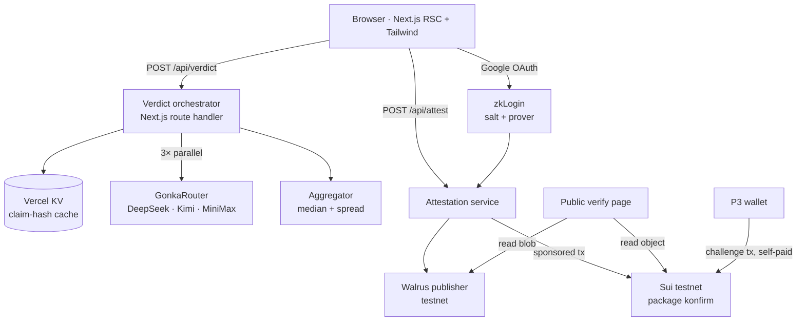

# TRD: Konfirm

| Field | Value |
|---|---|
| Author | Jaxz Tan Cheng Soo |
| Status | Draft |
| Version | 1.0 |
| Last updated | 2026-08-29 |
| Related PRD | PRD-konfirm.md |

---

## 1. Overview & scope

一个 Next.js 单体应用,部署在 Vercel。服务端编排三次并行 GonkaRouter 推理并聚合成判决;用户选择存证时,完整 reasoning 上传 Walrus,判决摘要写成 Sui testnet 上的一个 shared `Verdict` object。**没有关系型数据库** —— 链是唯一的真相来源,Vercel KV 仅作缓存。

本文覆盖 PRD 的 FR-1 → FR-16 与 NFR-1 → NFR-9。

**明确延后:** FR-13(challenge)合约与索引先做,前端提交入口视 M2 完成度决定;若 09-02 晚 M2 未跑通则整条砍掉,不影响主线。

---

## 2. Architecture



| Component | Responsibility |
|---|---|
| Web app | 输入页、判决页、公开验证页、卡片生成。App Router,判决页 client component,验证页 server component |
| Verdict orchestrator | 正规化 → 缓存查询 → 语言侦测 → 三路并行推理 → 聚合 |
| Aggregator | 纯函数,无 IO,单元测试覆盖 |
| Attestation service | Walrus 上传 → 构造 tx → sponsor 签名 → 执行 |
| Move package `konfirm` | `Verdict` / `Challenge` object 与 append-only 语义 |
| Vercel KV | 仅缓存,TTL 24h,丢失不影响正确性 |

部署目标:Vercel(单一 production 环境)。Move package 部署于 Sui testnet。

---

## 3. Tech stack & rationale

| Layer | Choice | Why | Alternative considered |
|---|---|---|---|
| Frontend | Next.js 15 (App Router) + TypeScript + Tailwind + shadcn/ui | 团队已熟;RSC 让验证页无需客户端 JS 即可读链 | Vite SPA — 验证页 SEO/OG 会差 |
| Backend | Next.js route handlers | 前后同仓,9 天内不值得拆服务 | 独立 NestJS — 多一层部署 |
| Database | 无 | 链即真相来源,不建用户表(PRD 第 3 节) | Postgres — 会引入「运营方可改」的攻击面 |
| Cache | Vercel KV (Redis) | 按 claim hash 缓存判决,直接服务 NFR-3 | 内存缓存 — serverless 冷启动即失效 |
| Auth | zkLogin (Google) | FR-11 的唯一实现路径 | 传统 OAuth + 托管钱包 — 违背 FR-11 精神 |
| Chain | Sui testnet,Move | object model 让 verdict 自带 permalink(FR-10) | EVM — mapping 无法给出对象级 ID |
| Storage | Walrus testnet | reasoning trace 太大不适合上链 | IPFS pin — 需自付 pinning,且非 Sui 生态 |
| AI | GonkaRouter(DeepSeek / Kimi / MiniMax) | 赛制强制;三模型交叉验证是 FR-3 | 直连模型厂商 — 违反 Gonka track 要求 |
| Hosting | Vercel | 零配置、预览环境、KV 同厂 | Cloudflare Workers — Next.js 适配更折腾 |

---

## 4. Data model

### 4.1 On-chain(Sui Move,append-only)

```move
module konfirm::registry {
    use std::string::String;

    const STATE_VERDICT: u8 = 0;
    const STATE_DISPUTED: u8 = 1;
    const STATE_UNVERIFIABLE: u8 = 2;
    const STATE_INSUFFICIENT: u8 = 3;
    const NO_SCORE: u8 = 255;

    public struct Verdict has key {
        id: UID,
        claim_hash: vector<u8>,     // 32B, sha256(normalize(text) || lang)
        lang: u8,                   // 0=en 1=ms 2=zh
        state: u8,
        score: u8,                  // 0-100, 或 NO_SCORE
        spread_lo: u8,
        spread_hi: u8,
        confidence: u8,             // 0=high 1=medium 2=n/a
        model_count: u8,
        models: vector<String>,
        request_ids: vector<String>, // Gonka Request IDs (FR-6)
        trace_blob: String,          // Walrus blob ID (FR-9)
        challenge_count: u64,        // 唯一可变字段,只增不减
        created_at_ms: u64,
        attester: address,
    }

    public struct Challenge has key {
        id: UID,
        verdict_id: ID,
        evidence_blob: String,
        challenger: address,
        created_at_ms: u64,
    }

    public struct VerdictCreated has copy, drop { verdict_id: ID, claim_hash: vector<u8> }
    public struct Challenged     has copy, drop { verdict_id: ID, challenge_id: ID }
}
```

**Entry functions —— 只有两个,没有 update,没有 delete:**

| Function | 效果 |
|---|---|
| `create_verdict(...)` | 创建 `Verdict` 并 `transfer::share_object`,emit `VerdictCreated` |
| `challenge(v: &mut Verdict, evidence_blob, clock, ctx)` | `v.challenge_count = v.challenge_count + 1`,创建并 share `Challenge`,emit `Challenged` |

`Verdict` 必须是 shared object,否则任何人无法 challenge。可变性被限制在 `challenge_count` 单一字段,这是「append-only」在有状态对象上的具体定义 —— 要在 README 与 pitch 里写清楚。

**链上不存原文**(NFR-4)。`claim_hash` 是原文指纹,任何人拿原文自己算一遍即可比对。

### 4.2 Off-chain

| Store | Key | Value | TTL |
|---|---|---|---|
| Vercel KV | `v:{claim_hash}` | 聚合后的 VerdictResult JSON | 24h |
| Vercel KV | `rl:{ip}` | 速率计数 | 60s |
| Walrus | blob | `{ models: [{model, requestId, verdict, score, redFlags, reasoning}] }`(PII 脱敏后) | 永久 |

---

## 5. API design

| Method | Path | Purpose | Auth | Maps to |
|---|---|---|---|---|
| POST | `/api/verdict` | 核查并返回聚合判决 | none(IP 限流) | FR-1 → FR-7 |
| POST | `/api/attest` | Walrus 上传 + sponsored tx 创建 Verdict | zkLogin JWT | FR-8, FR-9, FR-11, FR-12 |
| GET | `/v/[objectId]` | 公开验证页(RSC,直接读链) | none | FR-10, FR-15 |
| POST | `/api/card` | 生成反驳卡片文案 / OG 图 | none | FR-14 |
| GET | `/api/health` | Gonka 余额 + Sui faucet 余额,demo 前自查 | none | NFR-3 |

Challenge 由前端用 `@mysten/dapp-kit` 直接构造并让 P3 自己的钱包签名,**不经服务端**,因此没有对应 endpoint(FR-13)。

### `POST /api/verdict`

```jsonc
// request
{ "input": "转发内容或 https://...", "type": "text" }

// response
{
  "claimHash": "9f2b...",
  "lang": "zh",
  "state": "verdict",              // verdict | disputed | unverifiable | insufficient
  "score": 18,                     // state !== "verdict" 时为 null
  "spread": { "lo": 10, "hi": 25 },
  "confidence": "high",            // high | medium | null
  "modelCount": 3,
  "redFlags": { "consensus": ["no_source", "urges_forwarding"], "disputed": ["no_date"] },
  "models": [
    { "model": "deepseek-v3", "requestId": "gnk_01H...", "verdict": "likely_false",
      "score": 18, "redFlags": ["no_source","urges_forwarding"], "reasoning": "..." }
  ],
  "cached": false
}
```

聚合规则(纯函数 `aggregate()`):`unverifiable` 过半 → `state=unverifiable`,不给分;其余取 **中位数**(n=3 时可容忍 1 个离群值,平均数不行);`spread = max - min`;`lo < 40 && hi > 60`(跨界)或 `spread > 40` → `state=disputed`,不给分;`n>=3 && spread<=20` → `high`,否则 `medium`;`n==2` 封顶 `medium`;`n<=1` → `insufficient`。

---

## 6. Technical requirements

| ID | Requirement | Implements | Notes |
|---|---|---|---|
| TR-1 | 输入正规化:trim、折叠空白、剥离零宽字符与 emoji,再 `sha256(text \|\| lang)` | FR-1, NFR-3 | 不做会让同一条谣言多一个句号就 cache miss,白烧额度 |
| TR-2 | URL 分支用 Readability 抽正文,3s 超时,截断至 2000 字 | FR-1 | 见 TR-14 的 SSRF 防护 |
| TR-3 | 语言侦测优先用启发式(CJK 字符占比 / BM 停用词表),不确定时才交给模型 | FR-2, NFR-3 | 省一次调用 |
| TR-4 | 三语 prompt 模板,强制 JSON 输出,`temperature: 0` | FR-2, NFR-3 | temp=0 让同 claim 重跑可命中缓存 |
| TR-5 | `Promise.allSettled` + 12s `AbortController`,**不用** `Promise.all` | FR-3, NFR-1, NFR-7 | `Promise.all` 一个模型挂就整批 reject |
| TR-6 | `aggregate()` 为纯函数,含边界单元测试(n=1/2/3、跨界、全 unverifiable) | FR-4, NFR-7 | 唯一必须自动化测试的模块 |
| TR-7 | `redFlags` 为固定枚举;分歧点 = 各模型标注的对称差集,**不额外调用 LLM** | FR-5, FR-7, NFR-3 | 免费拿到 FR-5 的分歧定位 |
| TR-8 | Request ID 从 GonkaRouter response header/body 透传至 UI 与链上 | FR-6 | 评委验证 Gonka 使用的唯一凭证 |
| TR-9 | Move package `konfirm::registry`,两个 entry function,无 update/delete | FR-8, FR-13 | 部署地址写入 README(NFR-9) |
| TR-10 | Walrus 上传前跑 PII 脱敏正则:大马手机(`\+?60\d{8,9}`)、IC(`\d{6}-\d{2}-\d{4}`)、email | FR-9, NFR-4 | reasoning 可能复述原文中的个资 |
| TR-11 | 验证页为 server component,直连 fullnode 读 object,不经自家 API | FR-10 | 「不需要信任 Konfirm」的字面实现 |
| TR-12 | zkLogin:ephemeral keypair 存 `sessionStorage`,salt 走托管 service,永不落盘 | FR-11, NFR-2 | fallback 见 R-1 |
| TR-13 | Sponsor 账户 testnet SUI 由 faucet 供给;按 IP + claim_hash 双重限流 | FR-12, NFR-2 | 防 sponsor 余额被刷干 |
| TR-14 | URL 抓取阻断私有网段与非 http(s) scheme;所有输入长度硬上限 2000 字 | NFR-2, NFR-3 | SSRF 是本项目唯一的服务端注入面 |
| TR-15 | 判决页最小 16px;结论用大字 + 色块 + 文字三重表达;`disputed` 状态不渲染分数组件 | FR-4, NFR-5 | 色盲可读 |
| TR-16 | 降级横幅:`modelCount < 3` 时在判决页与卡片上都显示「仅 N 个模型参与」 | NFR-7 | 卡片上也要显示,否则转发出去就丢失了这个信息 |
| TR-17 | 卡片文案模板按语言分三套,语气规则写进 prompt:陈述证据,不评价转发者 | FR-14, NFR-6 | |
| TR-18 | 分享:`navigator.share` 可用则用,否则回落复制按钮 | FR-16 | iOS Safari / Android Chrome 各测一次 |

---

## 7. Security & compliance

**Secrets.** Gonka API key、sponsor 私钥、Walrus publisher 凭证全部只存 Vercel 环境变量,永不出现在客户端 bundle 或 repo。提交前跑 `gitleaks` 扫一次全历史(NFR-2、NFR-9)。

**Auth.** zkLogin 为唯一用户身份来源。Ephemeral keypair 只存 `sessionStorage`,随标签页关闭消失。服务端在 `/api/attest` 校验 JWT 与 nonce 绑定,防止他人借用 sponsor 额度。

**Custody.** Konfirm **不托管任何资产**,不发行代币,不进行价值转移。Sponsor 账户只持有 testnet SUI(无价值)。因此不触及 BNM / SC 任何牌照范围(NFR-8)—— 在 README 与 pitch 各写一次。

**输入验证.** 长度上限 2000 字;URL 仅允许 http/https 且解析后 IP 不在 RFC1918 / loopback / link-local 段;所有模型输出按 schema 校验后才进入聚合。

**限流.** `/api/verdict` 每 IP 10 次/分钟;`/api/attest` 每 IP 3 次/分钟。

**PII.** 链上仅 32 字节 hash,不可能反推原文(NFR-4)。Walrus 上的 reasoning 经 TR-10 脱敏。用户原文不落任何持久化存储 —— KV 里存的是聚合结果,key 是 hash 而非原文。

---

## 8. Infrastructure & environments

两个环境:本地(`.env.local` + Sui testnet)和 production(Vercel)。关闭 preview deployment,避免 demo 当天点错 URL。

CI:GitHub Actions 只跑两件事 —— `tsc --noEmit` 与 `aggregate()` 的单元测试。不做 Docker,不做 staging。

可观测性:Vercel runtime logs 足够。额外加 `/api/health` 手动查 Gonka 余额与 sponsor 余额,列进 demo 前检查清单。

---

## 9. Testing strategy

**自动化(仅一处):** `aggregate()` 的表驱动单元测试。这是唯一逻辑复杂到值得写测试的模块,也是最容易在演示时出错的地方。

**Demo 前 smoke checklist(每次跑完整 3 遍):**

1. 中文谣言 → 判决页语言正确 → 存证 → 验证页可开
2. BM 谣言 → 同上
3. EN 谣言 → 同上
4. URL 输入 → 正文抓取成功
5. 断开一个模型(改 env 指向错误 endpoint)→ 显示「仅 2 个模型参与」,横幅出现在卡片上
6. 已核查过的 claim 重跑 → `cached: true`,秒回
7. 陌生浏览器无痕开验证页 → 无登录墙,内容完整
8. Sui explorer 直链点开 → object 字段与页面一致
9. `/api/health` → Gonka 余额 > $5,sponsor 余额 > 1 SUI

---

## 10. Risks & mitigations

| Risk | Likelihood | Impact | Mitigation |
|---|---|---|---|
| R-1 · zkLogin 在 9 天内接不通(salt/prover 链路复杂) | 中 | 高 —— FR-11/12 全挂 | 09-01 设死线。未通则回落:服务端单一 attester keypair 代签,`attester` 字段记为服务地址。牺牲「用户自签」,保留不可篡改与可验证,demo 照跑 |
| R-2 · Walrus testnet 不可用或配额不足 | 中 | 中 —— FR-9 挂 | 回落 Vercel Blob 存 trace,链上 `trace_blob` 改存 `sha256(trace)`;完整性仍可验证,pitch 里说明这是 testnet 限制 |
| R-3 · $20 Gonka 额度在 demo 前烧完 | 中 | 高 —— 现场直接挂 | TR-1 缓存 + 2000 字上限 + temp=0;`/api/health` 每天查;pitch 前一天起冻结压测;备录屏 |
| R-4 · 某模型在 GonkaRouter 上返回非 JSON | 高 | 低 | schema 校验失败即当作该模型超时,走 NFR-7 降级路径 |
| R-5 · 现场网络不稳,live demo 卡在 20 秒 | 中 | 高 | 手机热点备用 + 预先跑过的 claim 走缓存路径演示 + 完整录屏 |
| R-6 · 评委认为 Sui 仍是 add-on | 中 | 高 —— 直接影响 track 得分 | verdict object ID 即 permalink(不另建短链)+ FR-13 challenge,两者都是「换成数据库就做不到」的性质;pitch 主动承认「上链不证明内容对,只证明没被改」 |

---

## 11. Estimation & sequencing

**关键路径:** TR-5 → TR-6 → TR-9 → TR-12。这四项全在 Jaxz 身上,任何一项延误直接推迟 M2。

| # | 工作 | Owner | Size | Depends |
|---|---|---|---|---|
| 1 | Repo + Next.js 骨架 + Vercel 接上 | FE | S | — |
| 2 | Gonka hello world,打出 Request ID | JZ | S | — |
| 3 | Sui testnet hello world + faucet | JZ | S | — |
| 4 | TR-1/3/4 正规化 + 语言侦测 + prompt 模板 | JZ | M | 2 |
| 5 | TR-5 三路并行 + 降级 | JZ | M | 4 |
| 6 | TR-6 `aggregate()` + 单测 | JZ | M | 5 |
| 7 | 判决页 UI(TR-15/16) | FE | L | 1,6 |
| 8 | 测试样本集 EN/BM/中文 各 10 条 + 人工标注 | PT | M | — |
| 9 | TR-9 Move package + 部署 testnet | JZ | M | 3 |
| 10 | TR-10 Walrus 上传 + 脱敏 | JZ | M | 9 |
| 11 | TR-12/13 zkLogin + sponsored tx | JZ | **L** | 9 |
| 12 | TR-11 公开验证页 | FE | M | 9 |
| 13 | TR-17/18 卡片 + 分享 | FE | M | 7 |
| 14 | FR-13 challenge(合约 + 前端) | JZ | M | 9,11 |
| 15 | README / 视频 / AI 工具声明 | PT | M | 12 |

**可并行:** 1/2/3 同日开工;8 与 4–6 无依赖,PT 可立即开始;7 与 9 分别由 FE / JZ 同时推进;12 与 11 无依赖,FE 可在 zkLogin 未完成时先用手动创建的 object 联调。

**唯一的 L:** 第 11 项。它决定 M2 成败,R-1 的 09-01 死线就是为它设的。

**第 14 项(challenge)在第 11 项完成后才开工。** 09-03 功能冻结前没做完就砍掉,不进代码,只进 pitch roadmap。
