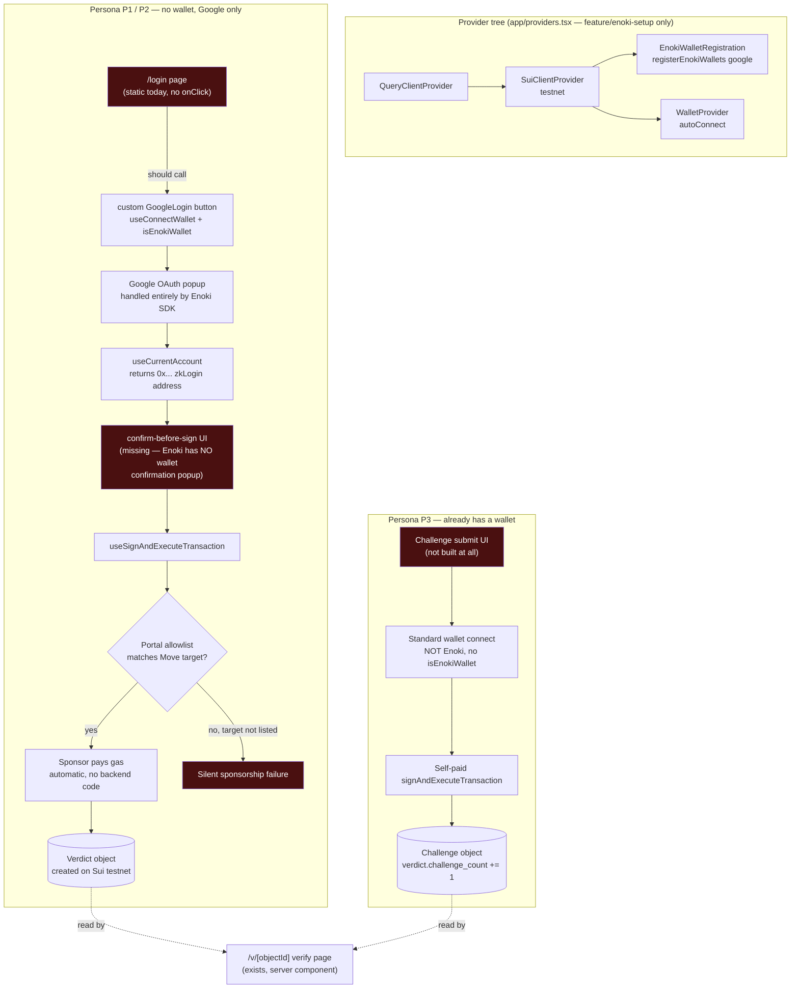

# Wallet setup — status and full graph

**Naming note:** this project has two unrelated things called "P1/P2": the PRD's personas (P1 = Wei Jie, P2 = Auntie Lim, P3 = community admin/NGO with their own wallet) and the team split in `docs/plan.md` (P1 = you, portal/keys; P2 = teammate, wallet UI). This doc uses **persona** P1/P2/P3 throughout, matching the PRD — not the team split.

There are **two separate wallet concepts** in this product, and they must not be merged into one flow:

1. **Enoki zkLogin wallet** — for persona P1/P2, who have no wallet and no crypto literacy. Google sign-in *becomes* their Sui address. Used for creating a `Verdict` (FR-11, FR-12).
2. **A real, self-owned wallet** — for persona P3, who already has one. Used only for submitting a `Challenge` (FR-13). No zkLogin, no sponsorship — P3 pays their own gas, and this is deliberate (TRD explicitly says challenge "不接 zkLogin、不接 sponsored tx").

---

## Current branch status

| Branch | Has provider setup? | Has Enoki wiring? | Builds clean? |
|---|---|---|---|
| `feature/enoki-setup` | ✅ `app/providers.tsx` (registerEnokiWallets, Google) | ✅ | not re-verified since `dev` moved forward |
| `dev` / `feature/wallet` (current) | ❌ none | ❌ none | ✅ yes, as of this doc (JSX bug + missing deps from earlier session both fixed) |

**The Enoki wallet code exists only on `feature/enoki-setup` and has not been merged.** `app/login/page.tsx` on the current branch is a static UI shell — three buttons (Google/Facebook/Apple), none wired to anything, no `onClick`, no dapp-kit import.

---

## Full graph — what the wallet layer looks like end to end

Red boxes = missing or non-functional today.

---

## Missing pieces (consolidated)

### Blocking / structural
1. **`feature/enoki-setup` not merged** — none of the provider/registration code exists on the branch the rest of the frontend is being built on. `app/login/page.tsx`'s buttons have no wiring to merge *into* yet.
2. **Move package not deployed** — `NEXT_PUBLIC_PACKAGE_ID` / `NEXT_PUBLIC_REGISTRY_ID` are still `0x...` placeholders. Blocks the Portal allowlist, blocks any real `submit_verdict`/`challenge` call, blocks end-to-end testing of sponsorship.
3. **`/api/attest` doesn't exist** — the TRD's API design lists this as the endpoint that ties zkLogin + Walrus upload + Verdict creation together. Nothing currently calls `useSignAndExecuteTransaction` anywhere in the app.

### Code cleanup (found while reviewing `feature/enoki-setup`)
4. **Stray duplicate file**: `app/providers 2.tsx` on `feature/enoki-setup` is an accidental leftover — an earlier draft of `providers.tsx` (uses `useSuiClient` + registers *inside* `WalletProvider`, the version that was later corrected). Delete before merging, or it'll shadow/confuse the real one.

### P1/P2 persona flow (Enoki)
5. `app/login/page.tsx` Google button has no `onClick` — needs the custom `<GoogleLogin />` component from `docs/plan.md` P2 task 1 (not bare `ConnectButton`, per `docs/Enoki_setup.md` §4.2 — P2 the persona is 58 and has zero crypto literacy).
6. Facebook and Apple buttons on the login page have **no corresponding Auth Provider registered in the Enoki Portal**, and Apple isn't even a supported Enoki provider (`google | facebook | twitch | onefc | playtron`). Per PRD FR-11, only Google is in scope — these two buttons should either be removed or explicitly marked "coming soon," not left as dead clicks.
7. `lib/signer.ts` (`useKonfirmIdentity()`) — not created.
8. Confirm-before-sign UI — not created. This is the actual mitigation for Enoki's "no wallet popup" gotcha; without it, `useSignAndExecuteTransaction` fires straight to chain on a stray click.
9. Logout (`useDisconnectWallet`) — not created.

### P3 persona flow (Challenge, FR-13)
10. **Nothing exists yet** — no wallet-connect UI for P3, no `Challenge` submission form, no read of `challenge_count` on the verify page. This is explicitly a *different* wallet integration (standard wallet-standard connect, not Enoki) and hasn't been started. TRD marks this whole feature as first-to-cut if `M2` (2026-09-02) isn't hit.

### Backend
11. Sponsorship correctness (P1 plan tasks 7–9) — depends on #2 and #3 above.

---

## Reference

- `docs/plan.md` — P1/P2 (team) task split
- `docs/Enoki_setup.md` — the team's Enoki playbook
- `docs/history.md` — chronological log of what's been built/removed and why
- `docs/Konfirm_PRD.md` §4 (personas), §5 (FR-11/12/13), §6 (user flow)
- `docs/Konfirm_TRD.md` §5 (API design), §11 (item #11, #14)
