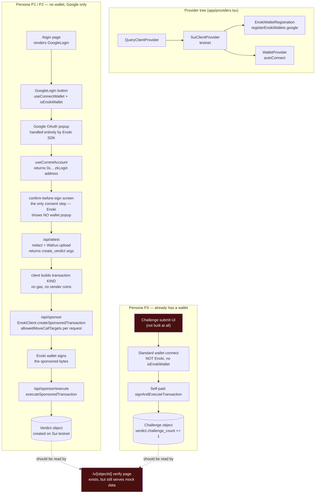

# Wallet setup — status and full graph

**Naming note:** this project has two unrelated things called "P1/P2": the PRD's personas (P1 = Wei Jie, P2 = Auntie Lim, P3 = community admin/NGO with their own wallet) and the team split in `docs/plan.md` (P1 = you, portal/keys; P2 = teammate, wallet UI). This doc uses **persona** P1/P2/P3 throughout, matching the PRD — not the team split.

There are **two separate wallet concepts** in this product, and they must not be merged into one flow:

1. **Enoki zkLogin wallet** — for persona P1/P2, who have no wallet and no crypto literacy. Google sign-in *becomes* their Sui address. Used for creating a `Verdict` (FR-11, FR-12).
2. **A real, self-owned wallet** — for persona P3, who already has one. Used only for submitting a `Challenge` (FR-13). No zkLogin, no sponsorship — P3 pays their own gas, and this is deliberate (TRD explicitly says challenge "不接 zkLogin、不接 sponsored tx").

---

## Current branch status — updated 2026-09-03

The split this section used to describe is gone. The Enoki code was merged into
`dev` (`c8bb5d8`), and `feature/enoki-setup` has since merged `dev` back in, so
both carry the same wallet layer. `app/login/page.tsx` is no longer a static
shell — it renders the real `<GoogleLogin />`, and the Facebook/Apple buttons
have been removed rather than left as dead clicks.

Verified on `feature/enoki-setup` at the time of writing: `tsc --noEmit` clean,
`oxlint` clean, 8/8 vitest, `next build` green across all 12 routes.

The Move package is **deployed to testnet** at
`0x9c2a668463843b5838f8ad6490fb8c87299094563ba52daa53ed7754342a7344`
(`move/Published.toml`), which unblocked everything that used to gate on it.

---

## Full graph — what the wallet layer looks like end to end

Red boxes = missing or non-functional today.

**The sponsorship path is a three-step server round trip, not an allowlist
flag.** An earlier version of this graph showed the Portal allowlist gating
automatic sponsorship with "no backend code" — that was wrong, and
`docs/plan.md` documents the reversal. `@mysten/enoki` 1.2.19's wallet exposes
no sponsorship path at all; both of its sign methods build gas against the
user's own address, which holds 0 SUI. Sponsorship lives behind
`EnokiClient.createSponsoredTransaction`, which needs `ENOKI_SECRET_KEY` and
therefore a server. The allowlist is a **per-request argument**
(`allowedMoveCallTargets`, `lib/enoki/sponsor.ts:40`), derived from
`NEXT_PUBLIC_PACKAGE_ID` — not a Portal field, so it cannot drift from the
deployed package.

---

## Missing pieces (consolidated)

### Still open

1. **P3 challenge flow (FR-13) — nothing exists.** No wallet-connect UI for P3,
   no `Challenge` submission form. `registry::challenge` is deliberately
   **not** in `allowedMoveCallTargets()`: P3 pays their own gas, so this is a
   standard wallet-standard connect, not Enoki. TRD marks it first-to-cut if
   `M2` (2026-09-02) isn't hit.
2. **`/v/[objectId]` still serves mock data.** `getVerdict()` returns
   `mockContent` and hardcodes `challengeCount: 0`; it never reads the chain.
   The write path now produces real `Verdict` objects, so the verify page is
   the last place the demo is still fictional — and it is the page a shared
   link actually lands on.
3. **Acceptance checks 3 and 5 unproven.** The user address showing 0 SUI, and
   the gas payer not being the user, are the only real evidence sponsorship
   works. Both need one real transaction inspected on the testnet explorer.
   Everything else can look correct and still be silently unsponsored.

### Closed since this doc was written

| Was | Now |
|---|---|
| Enoki code unmerged | Merged into `dev` (`c8bb5d8`) and back into `feature/enoki-setup` |
| Move package not deployed | Deployed to testnet, `move/Published.toml` |
| `NEXT_PUBLIC_REGISTRY_ID` placeholder | Removed entirely — vestigial, nothing read it |
| `/api/attest` doesn't exist | Exists, plus `/api/sponsor`, `/api/sponsor/execute`, `/api/health` |
| Stray `app/providers 2.tsx` | Deleted |
| Login button has no `onClick` | `<GoogleLogin />`, filters `useWallets()` by `isEnokiWallet` |
| Dead Facebook/Apple buttons | Removed — Google only, per FR-11 |
| `lib/signer.ts` not created | Exists — `useKonfirmIdentity()` |
| Confirm-before-sign UI not created | Exists in `app/page.tsx`, gates every write |
| Logout not created | `AccountBadge` → `signOut` → `useDisconnectWallet` |
| Sponsorship correctness | Server round trip built and rate-limited (3 req/min/IP) |

---

## Reference

- `docs/plan.md` — P1/P2 (team) task split
- `docs/Enoki_setup.md` — the team's Enoki playbook
- `docs/history.md` — chronological log of what's been built/removed and why
- `docs/Konfirm_PRD.md` §4 (personas), §5 (FR-11/12/13), §6 (user flow)
- `docs/Konfirm_TRD.md` §5 (API design), §11 (item #11, #14)
